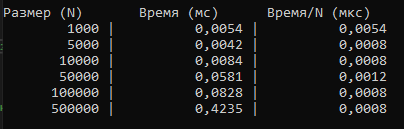

# Отчет по лабораторной работе 00
# Решение алгоритмических задач. Введение в инструменты и критерии оценки.

**Дата:** 2025-10-20

**Семестр:** 3 курс 1 полугодие - 5 семестр

**Группа:** ПИЖ-б-о-23-2

**Дисциплина:** Анализ сложности алгоритмов

**Студент:** Деревяшкин Валерий Васильевич

## Цель работы
* Настроить рабочее окружение, освоить базовые операции ввода/вывода написать и протестировать первую программу. 
* Научиться оценивать сложность отдельных операций и всей программы, проводить эмпирические замеры времени выполнения и визуализировать результаты.

## Теоретическая часть
* Алгоритм — это последовательность шагов для решения определенной задачи.
* Структуры данных — способы организации данных для эффективной работы с ними.
* Оценка решения: Правильность работы алгоритма и его эффективность (скорость работы и потребление памяти) — ключевые критерии качества.
* Ввод и вывод данных: Стандартные потоки ввода/вывода (stdin, stdout). 
* Работа с консолью.
* Сложность алгоритма: Количество операций, выполняемых алгоритмом, как функция от объема входных данных (N). Описывается с помощью О-нотации (O-большое).

## Практическая часть

### Выполненные задачи
- [x] Задача 1: Считывает два целых числа, a и b, из стандартного потока ввода.
- [x] Задача 2: Вычисляет их сумму.
- [x] Задача 3: Выводит результат в стандартный поток вывода

### Ключевые фрагменты кода
```csharp
foreach (int size in sizes)
{
    int[] data = new int[size];
    for (int i = 0; i < data.Length; i++)   // O(N)
        data[i] = rnd.Next(1, 1000);        // O(1)
    
    // Среднее время выполнения 1 итерации, с массивом на size элементов.
    double executionTime = MeasureTime(SumArray, data, 10); 
    times.Add(executionTime);

    // Время выполнения одного элемента(массива size) в микросекундах.
    double timePerElem = (executionTime * 1000) / size;
    Console.WriteLine($"{size, 12} | {executionTime, 15:F4} | {timePerElem, 15:F4}");
}
```

## Результаты выполнения

### Пример работы программы


## Выводы
1. Прямая зависимость времени от N (количество элементов)
2. Подтверждение теоретической сложности O(N)

## Приложения
- [Исходный код](https://github.com/uu546/DerevyashkinVV/blob/main/lab00/Program.cs)
- [Результат выполнения](https://github.com/uu546/DerevyashkinVV/tree/main/lab00/report)
