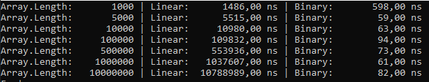
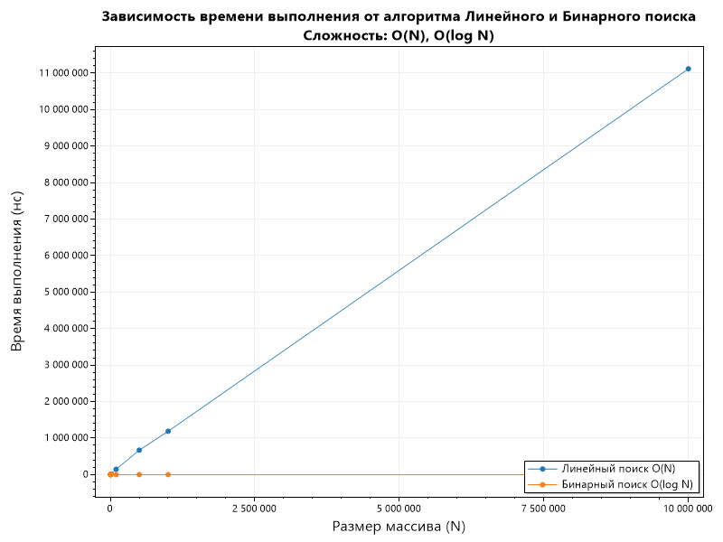
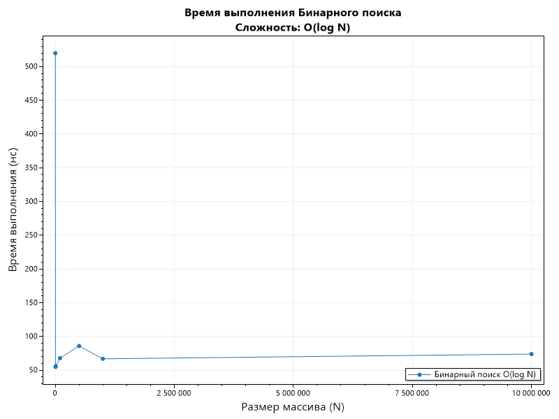

# Отчет по лабораторной работе 01
# Введение в алгоритмы. Сложность. Поиск.

**Дата:** 2025-10-20

**Семестр:** 3 курс 1 полугодие - 5 семестр

**Группа:** ПИЖ-б-о-23-2

**Дисциплина:** Анализ сложности алгоритмов

**Студент:** Деревяшкин Валерий Васильевич

## Цель работы
* Освоить понятие вычислительной сложности алгоритма. 
* Получить практические навыки реализации и анализа линейного и бинарного поиска.
* Научиться экспериментально подтверждать теоретические оценки сложности **O(n)** и **O(log n)**.

## Теоретическая часть
* Сложность алгоритма: Характеризует количество ресурсов (времени и памяти), необходимых алгоритму для обработки входных данных объема n.
* Асимптотический анализ: Анализ поведения алгоритма при стремлении n к бесконечности. Позволяет абстрагироваться от констант и аппаратных особенностей.
* O-нотация («О-большое»): Верхняя асимптотическая оценка роста функции. Определяет наихудший сценарий работы алгоритма.
* Линейный поиск (Linear Search): Последовательный перебор всех элементов массива. Сложность: O(n).
* Бинарный поиск (Binary Search): Поиск в отсортированном массиве путем многократного деления интервала поиска пополам. Сложность: O(log n). Требует предварительной сортировки (O(n log n)).

## Практическая часть

### Выполненные задачи
- [x] Задача 1: Реализовать функцию линейного поиска элемента в массиве.
- [x] Задача 2: Реализовать функцию бинарного поиска элемента в отсортированном массиве.
- [x] Задача 3: Провести теоретический анализ сложности обоих алгоритмов.
- [x] Задача 4: Экспериментально сравнить время выполнения алгоритмов на массивах разного размера.
- [x] Задача 5: Визуализировать результаты, подтвердив асимптотику O(n) и O(log n).

### Ключевые фрагменты кода
```csharp
/// <summary>
/// Метод поиска элемента в массиве.
/// </summary>
/// <param name="arr">Массив.</param>
/// <param name="targetValue">Число для поиска.</param>
/// <returns>Индекс найденного элемента.</returns>
int LinearSearch(int[] arr, int targetValue)
{
    for (int i = 0; i < arr.Length; i++)
    {
        if (arr[i] == targetValue)
        {
            return i;
        }
    }

    return -1;

    // Общая сложность O(n).
}
```

```csharp
/// <summary>
/// Метод бинарного поиска (только для отсортированных массивов).
/// </summary>
/// <param name="arr">Массив.</param>
/// <param name="targetValue">Число для поиска.</param>
/// <returns>Индекс найденного элемента.</returns>
int BinarySearch(int[] arr, int target)
{
    int left = 0;
    int right = arr.Length - 1;

    while (left <= right)
    {
        int mid = left + (right - left) / 2;

        if (arr[mid] == target)
        {
            return mid;
        }

        else if (arr[mid] < target)
        {
            left = mid + 1;
        }

        else
        {
            right = mid - 1;
        }
    }

    return -1;

    // Общая сложность O(log n)
}
```

```csharp
/// <summary>
/// Метод выполняет анализ алгоритмов.
/// </summary>
void ExecuteTest()
{    
    for (int i = 0; i < arrSizes.Length; i++)
    {
        int[] arr = GenerateSortedArray(arrSizes[i]);

        // Поиск последнего элемента, для полного выполнения алгоритма.
        int target = arr[arr.Length - 1];

        double linearTime = MeasureTime(LinearSearch, arr, target);
        double binaryTime = MeasureTime(BinarySearch, arr, target);

        sizes[i] = arrSizes[i];
        linearTimes[i] = linearTime;
        binaryTimes[i] = binaryTime;

        Console.WriteLine($"Array.Length: {arrSizes[i], 10} | Linear: {linearTime,12:F2} ns |" +
            $" Binary: {binaryTime,12:F2} ns");

    }
}
```

## Результаты выполнения

### Пример работы программы


#### Сравнительный график зависимости времени для линейного и бинарного поиска


#### График зависимости времени для бинарного поиска



## Ответы на контрольные вопросы
        
**1. Что такое асимптотическая сложность алгоритма и зачем она нужна?**
- Асимптотическая сложность (Big O) — это характеристика алгоритма, показывающая, как растёт время выполнения или расход памяти при увеличении размера входных данных.
Позволяет сравнивать алгоритмы по эффективности.

**2. Объясните разницу между O(1), O(n) и O(log n). Приведите примеры алгоритмов с такой сожностью.**
- O(1) — константная сложность: время выполнения не зависит от размера входных данных, доступ к элементу массива по индексу (arr[i]).
- O(n) — линейная сложность: время растёт пропорционально количеству элементов в массиве/списке, линейный поиск элемента в массиве, поиск минимального максимально элемента в массиве, накопление суммы.
- O(log n) — логарифмическая сложность: каждый шаг уменьшает размер задачи примерно вдвое,бинарный поиск в отсортированном массиве.

**3. В чем основное отличие линейного поиска от бинарного? Какие предварительные условия
необходимы для выполнения бинарного поиска?**
- Линейный поиск просматривает элементы последовательно, работает на любом массиве.
- Бинарный поиск делит массив пополам на каждом шаге, работает только на отсортированных массивах.
- Предварительное условие для бинарного поиска: массив должен быть отсортирован.
- Должна быть определена функция сравнения элементов массива под индексом.

**4. Почему на практике время выполнения алгоритма может отличаться от теоретической оценки O большое?**
- Константные факторы и накладные расходы: цикл, вызовы функций, кэш, ветвления.
- Аппаратные особенности: процессор, память, параллельность.
- Входные данные могут быть 'не худшим случаем', что влияет на время.

**5. Как экспериментально подтвердить, что сложность алгоритма равна O(n) или O(log n)? Опишите
план эксперимента.**
- Реализовать алгоритм.
- Подготовить наборы входных данных разного размера N.
- Замерять время выполнения для каждого N (несколько повторов для усреднения).
- Построить график.
- Проверить, что график линейный (O(n)) или растёт как  (O(log n)).

## Выводы
1. Линейный поиск показывает линейный рост времени O(n)
2. Бинарный поиск показывает логарифмический рост O(log n)
3. На малых массивах разница может быть незначительной
4. На больших массивах бинарный поиск значительно эффективнее


## Приложения
- [Исходный код C#](https://github.com/uu546/DerevyashkinVV/blob/main/lab01/Program.cs)
- [Результат выполнения](https://github.com/uu546/DerevyashkinVV/tree/main/lab01/report)
