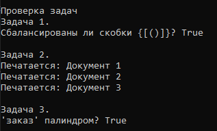
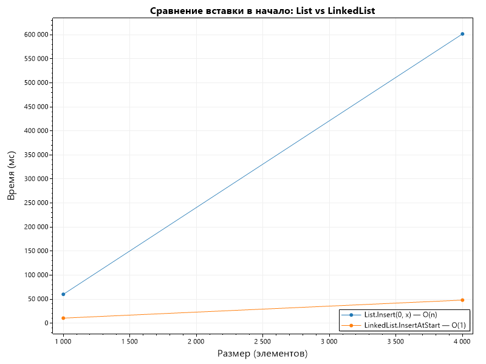
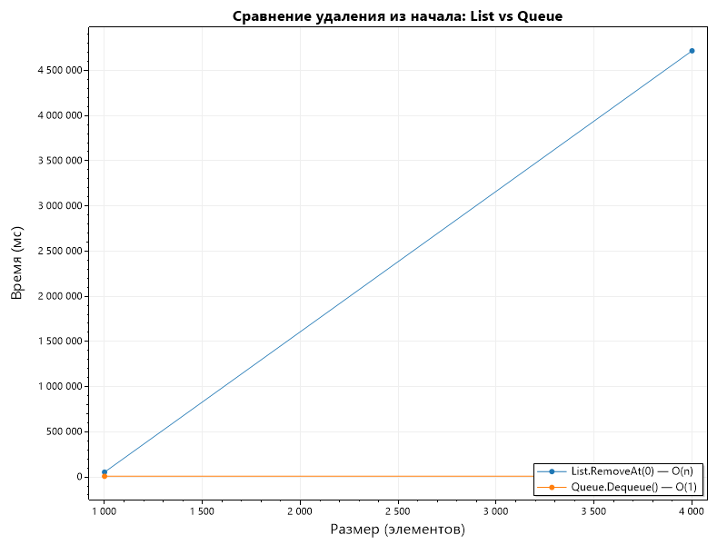

# Отчет по лабораторной работе 02

# Основные структуры данных. Анализ и применение.

**Дата:** 2025-10-20

**Семестр:** 3 курс 1 полугодие - 5 семестр

**Группа:** ПИЖ-б-о-23-2

**Дисциплина:** Анализ сложности алгоритмов

**Студент:** Деревяшкин Валерий Васильевич

## Цель работы

- Изучить понятие и особенности базовых абстрактных типов данных (стек, очередь, дек,
  связный список) и их реализаций в Python.
- Научиться выбирать оптимальную структуру данных для решения конкретной задачи, основываясь на анализе теоретической и практической сложности операций.
- Получить навыки измерения производительности и применения структур данных для решения практических задач.

## Теоретическая часть

- **Список (list) в Python:** Реализация динамического массива. Обеспечивает амортизированное
  время O(1) для добавления в конец (append). Вставка и удаление в середину имеют сложность
  O(n) из-за сдвига элементов. Доступ по индексу - O(1).
- **Связный список (Linked List):** Абстрактная структура данных, состоящая из узлов, где каждый
  узел содержит данные и ссылку на следующий элемент. Вставка и удаление в известное место
  (например, начало списка) выполняются за O(1). Доступ по индексу и поиск - O(n).
- **Стек (Stack):** Абстрактный тип данных, работающий по принципу LIFO (Last-In-First-Out).
  Основные операции: push (добавление, O(1)), pop (удаление с вершины, O(1)), peek (просмотр
  вершины, O(1)). В Python может быть реализован на основе списка.
- **Очередь (Queue):** Абстрактный тип данных, работающий по принципу FIFO (First-In-First-Out).
  Основные операции: enqueue (добавление в конец, O(1)), dequeue (удаление из начала, O(1)). В
  Python для эффективной реализации используется collections.deque.
- **Дек (Deque, двусторонняя очередь):** Абстрактный тип данных, позволяющий добавлять и
  удалять элементы как в начало, так и в конец. Все основные операции - O(1). В Python реализован
  в классе collections.deque.

## Практическая часть

### Выполненные задачи

- [x] Задача 1: Реализовать класс LinkedList (связный список) для демонстрации принципов его работы
- [x] Задача 2: Используя встроенные типы данных (list, collections.deque), проанализировать эффективность операций, имитирующих поведение стека, очереди и дека.
- [x] Задача 3: Провести сравнительный анализ производительности операций для разных структур данных (list vs LinkedList для вставки, list vs deque для очереди)
- [x] Задача 4: Решить 2-3 практические задачи, выбрав оптимальную структуру данных.

### Ключевые фрагменты кода

```csharp
/// <summary>
/// Класс узла связного списка.
/// </summary>
public class Node
{
    public int Value;         // O(1)

    public Node? Next;    // O(1)

    public Node(int value)
    {
        Value = value;      // O(1)
        Next = null;        // O(1)
    }
}
```

```csharp
/// <summary>
/// Класс связного списка.
/// </summary>
public class LinkedList
{
    private Node? head;

    /// <summary>
    /// Метод добавляет элемент в начало списка.
    /// </summary>
    public void InsertAtStart(int value)
    {
        Node newNode = new Node(value); // O(1)
        newNode.Next = head;            // O(1)
        head = newNode;                 // O(1)
    }

    /// <summary>
    /// Метод добавляет элмент в конец списка.
    /// </summary>
    public void InsertAtEnd(int value)
    {
        Node newNode = new Node(value);  // O(1)

        if (head is null)
        {
            head = newNode;              // O(1)
            return;
        }

        Node current = head;             // O(1)

        while (current.Next is not null) // O(N)
        {
            current = current.Next;      // O(1
        }

        current.Next = newNode;          // O(1)
    }

    /// <summary>
    /// Метод удаляет элемент из начала списка.
    /// </summary>
    public void DeleteFromStart()
    {
        if (head is not null)
        {
            head = head.Next;   // O(1)
        }
    }

    /// <summary>
    /// Метод обходит обьекты списка.
    /// </summary>
    public void Traverse()
    {
        Node? current = head;                    // O(1)

        while (current is not null)                  // O(N)
        {
            Console.Write($"{current.Value} ");
            current = current.Next;              // O(1)
        }

        Console.WriteLine();
    }
}
```

- **PerformanceAnalysis** - замеры класс для выполнений замеров, добавления и удалений элментов.

```csharp
double[] sizes = { 1000, 4000 };

 foreach (int size in sizes)
 {
     // Вставка в начало: List vs LinkedList.
     double listInsertTime = Measure(() =>
     {
         List<int> listInsert = new();

         for (int i = 0; i < size; i++)
         {
             listInsert.Insert(0, i); // O(N)
         }
     });

     double linkedInsertTime = Measure(() =>
     {
         LinkedList linkedList = new();

         for (int i = 0; i < size; i++)
         {
             linkedList.InsertAtStart(i); // O(1)
         }
     });

     listInsertTimes.Add(listInsertTime);
     linkedInsertTimes.Add(linkedInsertTime);

     // Удаления из начала: List vs Queue.
     double listRemoveTime = Measure(() =>
     {
         List<int> listRemove = Enumerable.Range(0, size).ToList();

         for (int i = 0; i < size; i++)
         {
             listRemove.RemoveAt(0); // O(N)
         }
     });

     double queueDequeueTime = Measure(() =>
     {
         Queue<int> queue = new Queue<int>(Enumerable.Range(0, size));

         for (int i = 0; i < size; i++)
         {
             queue.Dequeue(); // O(1)
         }
     });

     listRemoveTimes.Add(listRemoveTime);
     queueDequeueTimes.Add(queueDequeueTime);
 }

```

---

### Решение задач

- **Задание 1: Реализовать проверку сбалансированности скобок ({[()]}) с использованием стека**

```csharp
bool IsBracketsBalanced(string input)
{
     Stack<char> stack = new();

     foreach (char c in input)
     {
        // Добавляем скобки.
         if ("({[".Contains(c))
         {
             stack.Push(c);
         }

         else if (")}]".Contains(c))
         {
             if (stack.Count == 0)
             {
                 return false;
             }

             // Удаляем и получаем последний добавленный элемент.
             char open = stack.Pop();

            // Проверка пары для скобки.
             bool isNotValid = (open == '(' && c == ')') ||
                               (open == '[' && c == ']') ||
                               (open == '{' && c == '}');

             if (!isNotValid)
             {
                 return false;
             }
         }
     }

     bool isBalanced = stack.Count == 0;

     return isBalanced;

     // Сложность O(N)
}
```

- **Задание 2: Реализовать симуляцию обработки задач в очереди печати**

```csharp
void PrintQueueSimulation()
    {
        Queue<string> printQueue = new();
        printQueue.Enqueue("Документ 1");
        printQueue.Enqueue("Документ 2");
        printQueue.Enqueue("Документ 3");

        while (printQueue.Count > 0)
        {
            // Удаляем и получаем первый элемент в очереди.
            string dequeuedDocument = printQueue.Dequeue();

            Console.WriteLine($"Печатается: {dequeuedDocument}");
        }

        // Сложность O(N)
    }
```

- **Задание 3: Решить задачу "Палиндром" (проверка, является ли последовательность палиндромом)**

```csharp
bool IsPalindrome(string text)
    {
        LinkedList<char> deque = new LinkedList<char>();

        foreach (char c in text)
        {
            deque.AddLast(c);
        }

        while (deque.Count > 1)
        {
            // Сравниваем первый и последний элементы.
            if (deque.First!.Value != deque.Last!.Value)
            {
                return false;
            }

            // Удаляем первый и последний элементы, так как они уже проверены.
            deque.RemoveFirst();
            deque.RemoveLast();
        }

        return true;
    }
```

## Результаты выполнения

### Пример работы программы



#### Сравнительный график зависимости времени для вставки в начало List и LinkedList

- LinkedList быстрее, чем List, т.к. не требует сдвига элементов. При частых вставках в начало эффективней LinkedList.

#### Сравнительный график зависимости времени для удаления из начала List и Queue


Queue  показывают стабильное время, тогда как List сильно замедляется.
Для работы по принципу “первый пришёл — первый ушёл” лучше использовать Queue< или LinkedList, потому что есть доступ к первому элементу (узлу).

## Ответы на контрольные вопросы

**1. В чем ключевое отличие динамического массива (list в Python) от связного списка с точки зрения сложности операций вставки в начало и доступа по индексу?**
- В динамическом массиве (list) вставка в начало требует сдвига всех элементов - O(n), но доступ по индексу — O(1). 
  В связном списке вставка в начало — O(1), но доступ по индексу требует прохода по всем узлам - O(n).

**2. Объясните принцип работы стека (LIFO) и очереди (FIFO). Приведите по два примера их практического использования.**
- Стек (LIFO) — “последним пришёл, первым вышел”.
История действий (Undo/Redo).

- Очередь (FIFO) — “первым пришёл, первым вышел”.
Очередь задач в принтере.
Обработка где важна последовательность.

**3. Почему операция удаления первого элемента из списка (list) в Python имеет сложность O(n), а из дека (deque) - O(1)?**
- В list после удаления первого элемента требуется сдвинуть все остальные — O(n).
В deque элементы связаны двусторонними ссылками (указатель на первый элемент и последний элемент), удаление из начала не требует сдвига — O(1).

**4. Какую структуру данных вы бы выбрали для реализации системы отмены действий (undo) в текстовом редакторе? Обоснуйте свой выбор.**
- Подходит стек (Stack), последнее действие должно отменяться первым (принцип LIFO).
Каждое действие помещается в стек, при “Undo” — извлекается верхний элемент.

**5. Замеры показали, что вставка 1000 элементов в начало списка заняла значительно больше
времени, чем вставка в начало вашей реализации связного списка. Объясните результаты с точки зрения асимптотической сложности.**
- В list каждая вставка в начало требует сдвига всех элементов - O(n) 
  В LinkedList новый узел становится головой списка (newNode.Next = head) - O(1).
Поэтому общая вставка в list растёт из-за сдвига элементов, а в LinkedList - добавление мгновенное.

## Выводы

1. Вставка в начало: 
   * List O(n) Время растёт линейно с количеством элементов, Неэффективно для частых вставок в начало
   * LinkedList O(1) Эффективно при частых вставках
2. Удаление из начала:
   * List O(n) Время увеличивается с количеством элементов,	Не подходит для удалений из начала.
   * Queue / LinkedList	O(1) Почти горизонтальная линия,	Быстрое удаление, оптимально для FIFO

## Приложения

Исходный код классов
- [Node](https://github.com/uu546/DerevyashkinVV/blob/main/lab02/Node.cs)
- [LinkedList](https://github.com/uu546/DerevyashkinVV/blob/main/lab02/LinkedList.cs)
- [PerformanceAnalysis](https://github.com/uu546/DerevyashkinVV/blob/main/lab02/PerformanceAnalysis.cs)
- [TaskSolutions](https://github.com/uu546/DerevyashkinVV/blob/main/lab02/TaskSolutions.cs)
- [Результат выполнения](https://github.com/uu546/DerevyashkinVV/tree/main/lab02/report)
