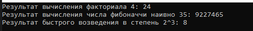
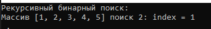
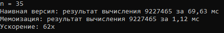
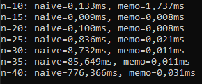
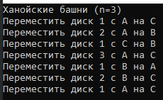
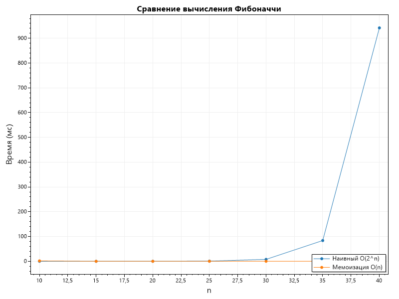

# Отчет по лабораторной работе 03

# Рекурсия

**Дата:** 2025-10-20

**Семестр:** 3 курс 1 полугодие - 5 семестр

**Группа:** ПИЖ-б-о-23-2

**Дисциплина:** Анализ сложности алгоритмов

**Студент:** Деревяшкин Валерий Васильевич

## Цель работы

- Освоить принцип рекурсии, научиться анализировать рекурсивные алгоритмы и
  понимать механизм работы стека вызовов. Изучить типичные задачи, решаемые рекурсивно, и освоить технику мемоизации для оптимизации рекурсивных алгоритмов. Получить практические навыки реализации и отладки рекурсивных функций.

## Теоретическая часть

- **Рекурсия:** Процесс, при котором функция прямо или косвенно вызывает саму себя для решения задачи.
- **Базовый случай (условие выхода):** Обязательное условие, которое прекращает рекурсивные
  вызовы и предотвращает зацикливание.
- **Рекурсивный шаг:** Шаг, на котором задача разбивается на более простую подзадачу того же типа и производится рекурсивный вызов.
- **Глубина рекурсии:** Количество вложенных вызовов функции. Ограничена размером стека
  вызовов.
- **Стек вызовов (Call Stack):** Структура данных, которая хранит информацию о незавершенных вызовах функций (локальные переменные, адрес возврата).
- **Мемоизация (Memoization):** Техника оптимизации, позволяющая избежать повторных
  вычислений результатов функций для одних и тех же входных данных путем сохранения ранее
  вычисленных результатов в кеше (например, в словаре).

## Практическая часть

### Выполненные задачи

- [x] Задача 1: Реализовать классические рекурсивные алгоритмы.
- [x] Задача 2: Проанализировать их временную сложность и глубину рекурсии.
- [x] Задача 3: Реализовать оптимизацию рекурсивных алгоритмов с помощью мемоизации.
- [x] Задача 4: Сравнить производительность наивной рекурсии и рекурсии с мемоизацией.
- [x] Задача 5: Решить практические задачи с применением рекурсии.

### Ключевые фрагменты кода

```csharp
/// <summary>
/// Класс реализует методы с использованием рекурсии.
/// </summary>
public static class Recursion
{
    /// <summary>
    /// Метод вычисляет факториал.
    /// </summary>
    /// <param name="n">Число.</param>
    /// <returns>Факториал.</returns>
    public static long Factorial(int n)
    {
        if (n < 0) throw new ArgumentException("n < 0");

        if (n <= 1) return 1;

        return n * Factorial(n - 1);

        // Сложность: O(n)
        // Глубина рекурсии: O(n)
    }

    /// <summary>
    /// Метод вычисляет n-го числа Фибоначчи (наивная версия).
    /// </summary>
    /// <param name="n">Число.</param>
    /// <returns>Число фибоначчи.</returns>
    public static long FibonacciNaive(int n)
    {
        if (n < 0) throw new ArgumentException("n < 0");

        if (n <= 1) return n;

        return FibonacciNaive(n - 1) + FibonacciNaive(n - 2);

        // Сложность: O(2^n)
        // Глубина рекурсии: O(n)
    }

    /// <summary>
    /// Метод возводит число в степень.
    /// </summary>
    /// <param name="a">Число.</param>
    /// <param name="n">Степень.</param>
    /// <returns>число в степени.</returns>
    public static double Power(double a, int n)
    {
        if (n < 0) return 1 / Power(a, -n);
        if (n == 0) return 1;
        if (n == 1) return a;

        if (n % 2 == 0)
        {
            double half = Power(a, n / 2);
            return half * half;
        }

        else
        {
            return a * Power(a, n - 1);
        }

        // Сложность: O(log n)
        // Глубина рекурсии: O(log n)
    }
}
```

- **PerformanceAnalysis** - класс для анализа производительности алгоритмов.

```csharp
/// <summary>
/// Метод сравнивает производительность наивной и мемоизированной версий числа Фибоначчи.
/// </summary>
 public static void FibonacciTest()
 {
     double[] sizes = [10, 15, 20, 25, 30, 35, 40];

     List<double> naiveTimes = new List<double>();
     List<double> memoTimes = new List<double>();

     foreach (int size in sizes)
     {
         double nativeTime = MeasurePerformance(x =>
         {
             Recursion.FibonacciNaive(x);
         }, size);

         double memoTime = MeasurePerformance(x =>
         {
             Memoization.FibonacciMemo(x);
         }, size);

         naiveTimes.Add(nativeTime);
         memoTimes.Add(memoTime);

         Console.WriteLine($"n={size}: naive={nativeTime}ms, memo={memoTime}ms");
     }
```

---

### Решение задач

- **Задание 1: Реализовать алгоритм бинарного поиска с использованием рекурсии.**

```csharp
int BinarySearchRecursive(int[] arr, int target, int left, int right)
    {
        if (left > right)
        {
            return -1;
        }

        int mid = left + (right - left) / 2;

        if (arr[mid] == target)
        {
            return mid;
        }

        if (arr[mid] > target)
        {
            return BinarySearchRecursive(arr, target, left, mid - 1);
        }

        else
        {
            return BinarySearchRecursive(arr, target, mid + 1, right);
        }

        // Сложность: O(log n)
        // Глубина рекурсии: O(log n)
    }
```

- **Задание 2: Решить задачу "Ханойские башни" для n дисков**

```csharp
void HanoiTowers(int n, char from, char to, char temp)
    {
        if (n == 1)
        {
            Console.WriteLine($"Переместить диск 1 с {from} на {to}");

            return;
        }

        HanoiTowers(n - 1, from, temp, to);

        Console.WriteLine($"Переместить диск {n} с {from} на {to}");

        HanoiTowers(n - 1, temp, to, from);

        // Сложность: O(2^n)
        // Глубина рекурсии: O(n)
    }
```

## Результаты выполнения

### Пример работы программы





#### Замер времени выполнения наивного и мемоизированного вычисления чисел Фибоначчи





#### Выполнение задачи Ханойские башни



#### Сравнительный график зависимости времени выполнения рекурсивного вычисления Фибоначчи с мемоизацией и без



- Мемоизация превращает экспоненциальный алгоритм в линейный за счет использования дополнительной памяти, которая позволяет возвращать ранее вычисленный элемент, без повторных рекурсивных вызовов метода.
- Каждый вызов метода(Fib(n)) вызывает два новых вызова (Fib(n - 1) и Fib(n - 2)), в результате приводит к очень быстрому росту.
- Вычисление числа Фибоначчи для n=5 количество рекурсивных вызовов составляет 15, для n=10 - уже 177 вызовов, для n=20 - 21,891 вызов, а для n=30 - **более 2.6 миллионов вызовов. Такой экспоненциальный рост делает алгоритм непрактичным для значений n > 35**, поскольку время выполнения быстро достигает нескольких минут, а затем часов.

## Ответы на контрольные вопросы

**1. Что такое базовый случай и рекурсивный шаг в рекурсивной функции? Почему отсутствие базового случая приводит к ошибке?**

- Базовый случай - это условие завершения рекурсии, при котором функция возвращает конкретное значение без выполнения рекурсивных вызовов (рекурсивного шага).
- Рекурсивный шаг - это часть функции, где происходит вызов самой себя с измененными параметрами, приближающими к базовому случаю.
- Отсутствие базового случая приводит к бесконечной рекурсии, что вызывает переполнение стека вызовов (StackOverflowException), так как каждый рекурсивный вызов занимает место в стеке, и без условия остановки этот процесс продолжается до исчерпания памяти.

**2. Объясните, как работает механизм мемоизации. Как он меняет временную сложность вычисления чисел Фибоначчи по сравнению с наивной рекурсией?**

- Мемоизация - это техника оптимизации, при которой результаты дорогостоящих вызовов функций сохраняются и при повторных вызовах с теми же параметрами возвращаются из кэша.
  Как меняется сложность Фибоначчи:
  Наивная рекурсия: O(2n) - экспоненциальная сложность
  С мемоизацией: O(n) - линейная сложность
- При первом вычислении Fib(n) все промежуточные значения сохраняются в словаре. Последующие вызовы возвращают сохраненные результаты за O(1).

**3. В чем заключается основная проблема глубокой рекурсии и как она связана со стеком вызовов?**
Основная проблема глубокой рекурсии - исчерпание памяти стека вызовов (call stack),приводит к исключению StackOverflowException.
Каждый рекурсивный вызов:

- Сохраняет текущий контекст выполнения
- Параметры функции
- Локальные переменные
- Адрес возврата

**4. Задача о Ханойских башнях решается рекурсивно. Опишите алгоритм решения для 3 дисков.**

- Алгоритм решения:
  - Переместить 2 верхних диска с стержня A на стержень B (используя C как вспомогательный)
  - Переместить самый большой диск с A на C
  - Переместить 2 диска с B на C (используя A как вспомогательный)

Последовательность перемещений для 3 дисков:

```
Переместить диск 1 с A на C
Переместить диск 2 с A на B
Переместить диск 1 с C на B
Переместить диск 3 с A на C
Переместить диск 1 с B на A
Переместить диск 2 с B на C
Переместить диск 1 с A на C
```

**5. Рекурсивный и итеративный алгоритмы могут решать одни и те же задачи. Назовите преимущества и недостатки каждого подхода.**

- Итеративный подход:
    Преимущества:
    - Эффективное использование памяти (нет накладных расходов стека)
    - Лучше подходят для больших входных данных.
    - Обычно быстрее, потому что не требуют рекурсивных вызовов.
    - Легче оптимизируется компилятором
  
    Недостатки:
    - Некоторые задачи сложнее выразить итеративно (например, рекурсивный обход дерева).
###
- Рекурсивный подход:
    Преимущества:
    - Код проще и короче
    - Более удобно решать задачи которые математически решаются рекурсивно (обход дерева, факториал, Фибоначчи, Ханойские башни).

    Недостатки:
    - Большой расход памяти из-за глубины стека вызовов.
    - Возможен StackOverflow, если глубина рекурсии велика.
    - Часто ниже производительность из-за множества вызовов функций.
    - Иногда выполняются повторные вычисления (например, наивный Фибоначчи).

## Выводы

1. Наивный рекурсивный алгоритм Фибоначчи имеет экспоненциальную сложность O(2n), что делает его непрактичным для n > 35 из-за быстрого роста времени выполнения.
2. Мемоизация преобразует сложность алгоритма с O(2n) на O(n), обеспечивая ускорение в сотни тысяч раз для больших значений n(>35).
3. Основная проблема наивной рекурсии - многократное вычисление одинаковых значений, что приводит к избыточным операциям и экспоненциальному росту.

## Приложения

Исходный код классов

- [Recursion](https://github.com/uu546/DerevyashkinVV/blob/main/lab03/Recursion.cs)
- [Memoization](https://github.com/uu546/DerevyashkinVV/blob/main/lab03/Memoization.cs)
- [RecursionTask](https://github.com/uu546/DerevyashkinVV/blob/main/lab03/RecursionTask.cs)
- [PerformanceAnalysis](https://github.com/uu546/DerevyashkinVV/blob/main/lab03/PerformanceAnalysis.cs)
- [Результат выполнения](https://github.com/uu546/DerevyashkinVV/blob/main/lab03/report)