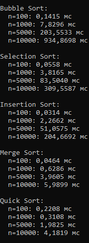
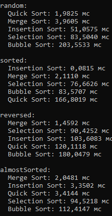
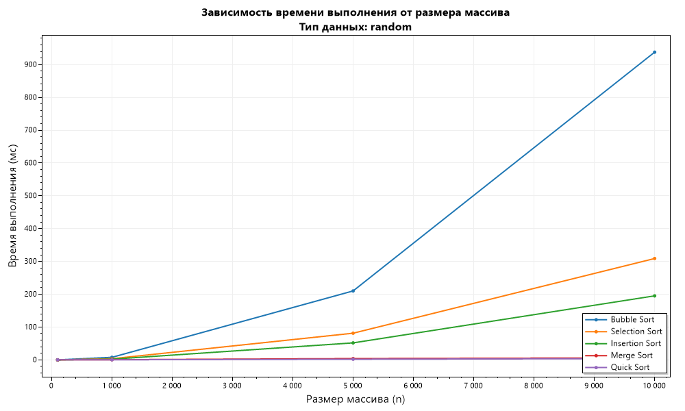
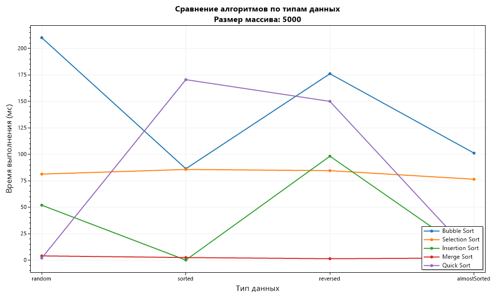

# Отчет по лабораторной работе 04

# Рекурсия

**Дата:** 2025-10-20

**Семестр:** 3 курс 1 полугодие - 5 семестр

**Группа:** ПИЖ-б-о-23-2

**Дисциплина:** Анализ сложности алгоритмов

**Студент:** Деревяшкин Валерий Васильевич

## Цель работы

- Изучить и реализовать основные алгоритмы сортировки.
- Провести их теоретический и практический сравнительный анализ по временной и пространственной сложности.
- Исследовать влияние начальной упорядоченности данных на эффективность алгоритмов.
- Получить навыки эмпирического анализа производительности алгоритмов.

## Теоретическая часть

- **Сортировка пузырьком (Bubble Sort):** Многократно проходит по массиву, сравнивая и меняя местами соседние элементы. Сложность: O(n²) во всех случаях.
- **Сортировка выбором (Selection Sort):** На каждом проходе находит минимальный элемент из неотсортированной части и ставит его на очередную позицию. Сложность: O(n²).
- **Сортировка вставками (Insertion Sort):** Построение окончательного массива путем пошагового вставления каждого элемента в правильную позицию в уже отсортированной части. Сложность: O(n²) в худшем и среднем, O(n) в лучшем (уже отсортированный массив).
- **Сортировка слиянием (Merge Sort):** Рекурсивный алгоритм "разделяй и властвуй". Массив разбивается на две части, которые сортируются рекурсивно, а затем сливаются в один отсортированный массив. Сложность: O(n log n) во всех случаях. Требует O(n) дополнительной памяти.
- **Быстрая сортировка (Quick Sort):** Рекурсивный алгоритм "разделяй и властвуй".Выбирается опорный элемент, массив разделяется на элементы меньше и больше опорного, которые сортируются рекурсивно. Сложность: O(n log n) в среднем, O(n²) в худшем случае(плохой выбор опорного элемента). Сортировка на месте, не требует дополнительной памяти.

## Практическая часть

### Выполненные задачи

- [x] Задача 1: Реализовать 5 алгоритмов сортировки.
- [x] Задача 2: Провести теоретический анализ сложности каждого алгоритма.
- [x] Задача 3: Экспериментально сравнить время выполнения алгоритмов на различных наборах данных.
- [x] Задача 4: Проанализировать влияние начальной упорядоченности данных на эффективность сортировок.

### Ключевые фрагменты кода

```csharp
/// <summary>
/// Метод реализует алгоритм пузырьковой сортировки.
/// </summary>
/// <param name="array">Массив.</param>
public static void BubbleSort(int[] array)
{
    for (int i = 0; i < array.Length - 1; i++)
    {
        for (int j = 0; j < array.Length - i - 1; j++)
        {
            if (array[j] > array[j + 1])
            {
                int temp = array[j];
                array[j] = array[j + 1];
                array[j + 1] = temp;
            }
        }
    }

    // Сложность алгоритма: O(n^2)
    // Пространственная сложность: O(1)
}

/// <summary>
/// Метод реализует алгоритм сортировка выбором (Selection Sort).
/// </summary>
/// <param name="array">Массив.</param>
public static void SelectionSort(int[] array)
{
    int n = array.Length;

    for (int i = 0; i < n - 1; i++)
    {
        int minIndex = i;

        for (int j = i + 1; j < n; j++)
        {
            if (array[j] < array[minIndex])
            {
                minIndex = j;
            }
        }

        // Обмен минимального элемента с текущим
        array[i] = array[minIndex];
        array[minIndex] = array[i];
    }

    // Сложность алгоритма: O(n^2)
    // Пространственная сложность: O(1)
}

/// <summary>
/// Метод реализует алгоритм сортировка вставками (Insertion Sort).
/// </summary>
/// <param name="array">Массив.</param>
public static void InsertionSort(int[] array)
{
    int n = array.Length;

    for (int i = 1; i < n; i++)
    {
        int key = array[i];
        int j = i - 1;

        // Сдвигаем элементы больше key вправо
        while (j >= 0 && array[j] > key)
        {
            array[j + 1] = array[j];
            j--;
        }

        array[j + 1] = key;
    }

    // Сложность алгоритма: O(n^2)
    // Пространственная сложность: O(1)
}

/// <summary>
/// Метод реализует алгоритм сортировка слиянием (Merge Sort) - рекурсия.
/// </summary>
/// <param name="array">Массив.</param>
public static void MergeSort(int[] array)
{
    if (array.Length <= 1) return;
    MergeSort(array, 0, array.Length - 1);

    // Сложность алгоритма:: O(n log n)
    // Пространственная сложность: O(n)
}

private static void MergeSort(int[] array, int left, int right)
{
    if (left < right)
    {
        int mid = left + (right - left) / 2;

        // Рекурсивно сортируем левую и правую части
        MergeSort(array, left, mid);
        MergeSort(array, mid + 1, right);

        // Сливаем отсортированные части
        Merge(array, left, mid, right);
    }
}

private static void Merge(int[] array, int left, int mid, int right)
{
    int n1 = mid - left + 1;
    int n2 = right - mid;

    // Временные массивы
    int[] leftArr = new int[n1];
    int[] rightArr = new int[n2];

    Array.Copy(array, left, leftArr, 0, n1);
    Array.Copy(array, mid + 1, rightArr, 0, n2);

    int i = 0, j = 0, k = left;

    // Сливаем временные массивы обратно в arr
    while (i < n1 && j < n2)
    {
        if (leftArr[i] <= rightArr[j])
        {
            array[k] = leftArr[i];
            i++;
        }
        else
        {
            array[k] = rightArr[j];
            j++;
        }
        k++;
    }

    // Копируем оставшиеся элементы
    while (i < n1)
    {
        array[k] = leftArr[i];
        i++;
        k++;
    }

    while (j < n2)
    {
        array[k] = rightArr[j];
        j++;
        k++;
    }
}

/// <summary>
/// Метод реализует алгоритм быстрая сортировка (Quick Sort) - рекурсия.
/// </summary>
/// <param name="array">Массив.</param>
public static void QuickSort(int[] array)
{
    if (array.Length <= 1) return;
    QuickSort(array, 0, array.Length - 1);

    // Сложность алгоритма: O(n log n) - средний, O(n^2) - худший
    // Пространственная сложность: O(log n) - средний, O(n) - худший
}

private static void QuickSort(int[] array, int low, int high)
{
    if (low < high)
    {
        // Разделение массива и получение индекса опорного элемента
        int pivotIndex = Partition(array, low, high);

        // Рекурсивно сортируем элементы до и после опорного
        QuickSort(array, low, pivotIndex - 1);
        QuickSort(array, pivotIndex + 1, high);
    }
}

private static int Partition(int[] array, int low, int high)
{
    // Опорный элемент (последний)
    int pivot = array[high];
    int i = low - 1;

    for (int j = low; j < high; j++)
    {
        if (array[j] <= pivot)
        {
            i++;
            (array[i], array[j]) = (array[j], array[i]);
        }
    }

    // Помещаем опорный элемент на правильную позицию
    (array[i + 1], array[high]) = (array[high], array[i + 1]);
    return i + 1;
}
```

---

## Результаты выполнения

### Пример работы программы

#### Зависимость времени от размера (данные random)



#### Зависимость времени от типа данных (n = 5000)



##### Наиболее эффективные алгоритмы по типам данных

- Случайные данные (random):

  - Лучший: Quick Sort - демонстрирует лучшую производительность благодаря среднему случаю O(n log n)
  - Альтернатива: Merge Sort - стабильная производительность, но требует дополнительной памяти

- Уже отсортированные данные (sorted):

  - Лучший: Insertion Sort - достигает O(n) в лучшем случае
  - Худший: Quick Sort - O(n^2) при неудачном выборе опорного элемента

- Обратно отсортированные (reversed):

  - Лучший: Merge Sort - стабильные O(n log n) независимо от входных данных
  - Худший: Quick Sort - гарантированный худший случай O(n^2)

- Почти отсортированные (almost_sorted):
  - Лучший: Insertion Sort - близок к O(n) благодаря минимальному количеству обменов
  - Эффективен: Bubble Sort (с оптимизацией) - быстро завершается при отсутствии обменов

#### Сравнительный график зависимости времени выполнения алгоритмов сортировки от размера массива, на типе данных "random"



#### Сравнительный график зависимости времени выполнения алгоритмов сортировки c размером 5000



##### Insertion Sort эффективен для маленьких или почти отсортированных массивов

- Показывает лучшие результаты при n < 1000
- На почти отсортированных данных (95% упорядоченности) работает, чем на случайных
- Хорошо подходит для ситуаций, где данные поступают уже частично упорядоченными

##### Quick Sort - лучший выбор в среднем случае

- На случайных данных(random) превосходит другие алгоритмы при n > 1000
- В среднем случае работает за O(n log n)
- Неустойчив к специально подобранным данным (обратно отсортированные массивы)

##### Merge Sort - стабилен и предсказуем по времени

- Гарантированная сложность O(n log n) для любых входных данных
- Лучший выбор когда важна стабильность и предсказуемость

##### Bubble Sort - эффективен для маленьких или почти отсортированных массивов

- Квадратичный рост времени(O(n^2)) при увеличении размера данных
- Преимущество - простота реализации
- На реальных данных не рекомендуется к использованию

##### Selection Sort - стабильно неэффективен

- Всегда O(n^2) независимо от входных данных
- Меньше обменов чем у Bubble Sort, но больше сравнений

## Ответы на контрольные вопросы

**1. Какие алгоритмы сортировки имеют сложность O(n²) в худшем случае, а какие - O(n log n)?**

- O(n^2) в худшем случае:
  - Bubble Sort (пузырьковая сортировка)
  - Selection Sort (сортировка выбором)
  - Insertion Sort (сортировка вставками)

###

- O(n log n) в худшем случае:
  - Merge Sort (сортировка слиянием)
  - Quick Sort (быстрая сортировка) - в среднем случае O(n log n), но O(n^2) в худшем

**2. Почему сортировка вставками (Insertion Sort) эффективна для маленьких или почти отсортированных массивов?**

- Для маленьких массивов:

  - Малое количество сравнений и обменов
  - Низкие накладные расходы (простая реализация)
  - Меньше вспомогательных действий, без выделния памяти и копирования, чем у сложных алгоритмов

- Для почти отсортированных массивов:
  - Минимальное количество обменов (близко к O(1) на элемент)
  - Быстро обнаруживает уже упорядоченные последовательност
  - В лучшем случае достигает O(n), когда массив уже отсортирован

**3. В чем разница между устойчивой (stable) и неустойчивой (unstable) сортировкой? Приведите пример устойчивого и неустойчивого алгоритма.**

- Устойчивая сортировка сохраняет относительный порядок элементов с одинаковыми ключами.
- Неустойчивая сортировка может изменить порядок элементов с одинаковыми ключами.

```csharp
// Исходный массив объектов (Name, Age)
var people = [
    ("Alice", 25), ("Bob", 30), ("Charlie", 25), ("David", 30)
];

// После сортировки по Age(ключу):

// Устойчивая сортировка (Merge Sort, Insertion Sort):
// [("Alice", 25), ("Charlie", 25), ("Bob", 30), ("David", 30)]
// Порядок Alice и Charlie сохранен

// Неустойчивая сортировка (Quick Sort, Heap Sort):
// Может быть: [("Charlie", 25), ("Alice", 25), ("David", 30), ("Bob", 30)]
// Порядок Alice и Charlie мог поменяться
```

- Устойчивые алгоритмы: Merge Sort, Insertion Sort, Bubble Sort
- Неустойчивые алгоритмы: Quick Sort, Heap Sort, Selection Sort

**4. Опишите принцип работы алгоритма быстрой сортировки (Quick Sort). Что такое "опорный элемент" и как его выбор влияет на производительность?**

- Принцип "разделяй и властвуй":
  1. Выбор опорного элемента (pivot) из массива
  2. Разделение - переупорядочивание массива так, чтобы элементы меньше опора оказались слева, больше - справа
  3. Рекурсивное применение к подмассивам слева и справа от опора

###

- Влияние выбора опорного элемента:
  Хороший выбор (средний случай O(n log n)):
  1. Середина массива

  Плохой выбор (худший случай O(n^2)):
  1. Минимальный или максимальный элемент (массив уже отсортирован)

**5. Сортировка слиянием (Merge Sort) гарантирует время O(n log n), но требует дополнительной памяти. В каких ситуациях этот алгоритм предпочтительнее быстрой сортировки?**
- Merge Sort предпочтительнее когда:
  - Требуется гарантированная производительность
  - Всегда O(n log n), нет худшего случая O(n^2)
  - Критические системы реального времени
  - Важна устойчивость сортировки
  - Сохраняет порядок равных элементов
  - Обработка сложных объектов с несколькими ключами(устойсивая сортировка)
  - Всегда O(n) дополнительной памяти
  - Легче планировать ресурсы в специфичных системах

## Выводы

1. Универсальное решение: Quick Sort
2. Критические системы: Merge Sort для гарантированной производительности
3. Специфичные случаи: Insertion Sort для частично упорядоченных данных
4. Современный подход: Гибридные алгоритмы, адаптирующиеся к типу данных

## Приложения

Исходный код классов

- [Sorts](https://github.com/uu546/DerevyashkinVV/blob/main/lab04/Sorts.cs)
- [GenerateData](https://github.com/uu546/DerevyashkinVV/blob/main/lab04/GenerateData.cs)
- [PerformanceTest](https://github.com/uu546/DerevyashkinVV/blob/main/lab04/PerformanceTest.cs)
- [Результат выполнения](https://github.com/uu546/DerevyashkinVV/blob/main/lab04/report)
