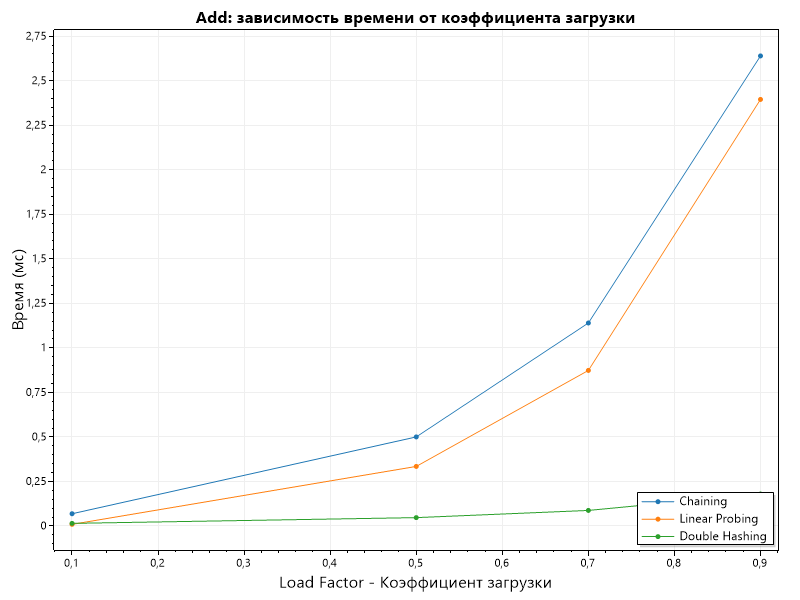
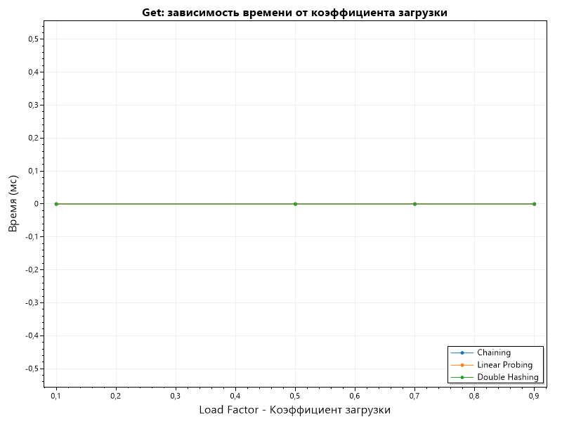
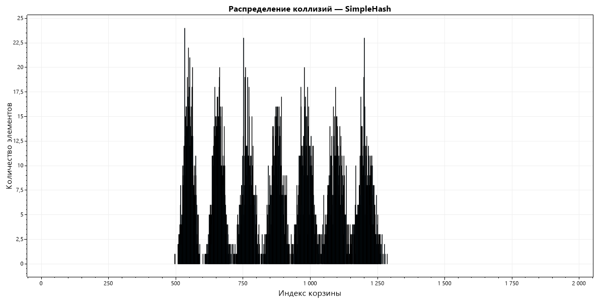
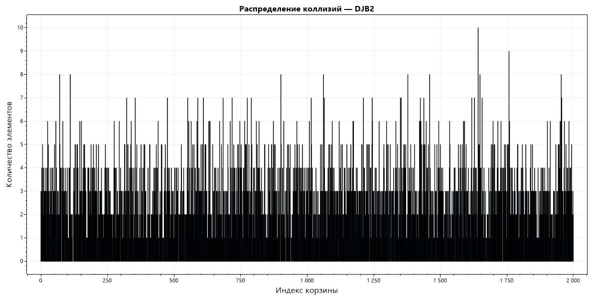
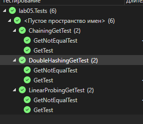

# Отчет по лабораторной работе 05

# Хеш-функции и хеш-таблицы

**Дата:** 2025-10-20

**Семестр:** 3 курс 1 полугодие - 5 семестр

**Группа:** ПИЖ-б-о-23-2

**Дисциплина:** Анализ сложности алгоритмов

**Студент:** Деревяшкин Валерий Васильевич

## Цель работы

- Изучить принципы работы хеш-функций и хеш-таблиц.
- Освоить методы разрешения коллизий.
- Получить практические навыки реализации хеш-таблицы с различными стратегиями разрешения коллизий.
- Провести сравнительный анализ эффективности разных методов.

## Теоретическая часть

- **Хеш-функция:** Функция, преобразующая произвольные данные в данные фиксированного
  размера (хеш-код). Требования: детерминированность, равномерное распределение, скорость вычисления.
- **Хеш-таблица:** Структура данных, реализующая ассоциативный массив. Обеспечивает в среднем
  O(1) для операций вставки, поиска и удаления.
- **Коллизия:** Ситуация, когда разные ключи имеют одинаковый хеш-код.
- **Метод цепочек (Chaining):** Каждая ячейка таблицы содержит список элементов с одинаковым хешем. Сложность: O(1 + α), где α - коэффициент заполнения.
- **Открытая адресация (Open Addressing):** Все элементы хранятся в самом массиве. При коллизии ищется следующая свободная ячейка согласно probe sequence.
- **Двойное хеширование (Double Hashing):** Метод открытой адресации, использующий вторую хеш-функцию для определения шага probing.

## Практическая часть

### Выполненные задачи

- [x] Задача 1: Реализовать несколько хеш-функций для строковых ключей.
- [x] Задача 2: Реализовать хеш-таблицу с методом цепочек.
- [x] Задача 3: Реализовать хеш-таблицу с открытой адресацией (линейное пробирование и двойное хеширование).
- [x] Задача 4: Провести сравнительный анализ эффективности разных методов разрешения коллизий.
- [x] Задача 5: Исследовать влияние коэффициента заполнения на производительность.

### Ключевые фрагменты кода

Реализация хеш-функций

```csharp
/// <summary>
/// Метод реализует хеш-функцию, сумма кодов символов.
/// </summary>
/// <param name="key">Ключ.</param>
/// <param name="tableSize">Размер таблицы.</param>
/// <returns>Хеш - представление ключа.</returns>
SimpleHash(string key, int tableSize)
{
    int sum = 0;

    foreach (char c in key)
    {
        sum += c;
    }

    int result = sum % tableSize;

    return result;

    // O(n) по длине строки.
    // Хеш зависит от суммы символов -> строки с одинаковой суммой будут давать одинаковый хеш.
    // Плохое распределение -> большая вероятность коллизий.
}

/// <summary>
/// Метод реализует полиномиальную хеш-функцию.
/// </summary>
/// <param name="key">Ключ.</param>
/// <param name="tableSize">Размер таблицы.</param>
/// <param name="p">База(Основание полинома).</param>
/// <returns>Хеш - представление ключа.</returns>
 PolynomialHash(string key, int tableSize, int p = 31)
{
    long hash = 0;
    long pPow = 1;

    foreach (char c in key)
    {
        hash = (hash + (c * pPow)) % tableSize;
        pPow = (pPow * p) % tableSize;
    }

    return (int)hash;

    // O(n) по длине строки.
    // Хорошее распределение.
    // Чувстительно к параметру p(основание поолинома).
    // Оптимальна для строк, особенно при большой загрузке таблицы.
}

/// <summary>
/// Метод реализует DJB2 хеш-функцию.
/// </summary>
/// <param name="key">Ключ.</param>
/// <param name="tableSize">Размер таблицы.</param>
/// <returns>Хеш - представление ключа.</returns>
Djb2Hash(string key, int tableSize)
{
    ulong hash = 5381;

    foreach (char c in key)
    {
        hash = (hash << 5) + hash + c;
    }

    return (int)(hash % (ulong)tableSize);

    // O(n) по длине строки.
    // Одно из лучших распределений.
    // Малое число коллизий.
}
```

**Реализация хеш-таблиц**

- Открытая адресация - метод двойное хеширование.

```csharp
// Средняя сложность:
//  Insert: O(1)
//  Search: O(1)
//  Delete: O(1)
//
// Худший случай: при коллизии, и поиске свободного индекса,
//                для расположения новой пары(ключ, значение).
//  Insert: O(n)
//  Search: O(n)
//  Delete: O(n)

/// <summary>
/// Класс реализует хеш-таблицу открытой адресации метод двойного хеширования.
/// </summary>
public class HashTableDoubleHashing
{
    /// <summary>
    /// Ключи.
    /// </summary>
    private string[] _keys;

    /// <summary>
    /// Значения.
    /// </summary>
    private string[] _values;

    /// <summary>
    /// Количество добавленных элементов в таблицу.
    /// </summary>
    private int _count;

    /// <summary>
    /// Конструктор.
    /// </summary>
    /// <param name="size">Размер таблицы.</param>
    public HashTableDoubleHashing(int size)
    {
        _keys = new string[size];
        _values = new string[size];
    }

    /// <summary>
    /// Метод получает значение по ключу.
    /// </summary>
    /// <param name="key">Ключ.</param>
    /// <returns>Значение.</returns>
    public string? Get(string key)
    {
        int index = HashFunction.SimpleHash(key, _keys.Length);

        while (_keys[index] is not null)
        {

            if (_keys[index] == key)
            {
                return _values[index];
            }

            index = (index + 1) % _keys.Length;
        }

        return null;
    }

    /// <summary>
    /// Метод удаляет пару(ключ, значение) по ключу.
    /// </summary>
    /// <param name="key">Ключ.</param>
    /// <returns>Признак удаления.</returns>
    public bool Delete(string key)
    {
        int index = HashFunction.SimpleHash(key, _keys.Length);

        while (_keys[index] is not null)
        {
            if (_keys[index] == key)
            {
                _keys[index] = null;
                _values[index] = null;

                _count--;

                return true;
            }

            index = (index + 1) % _keys.Length;
        }

        return false;
    }

    /// <summary>
    /// Метод второй хеш-функции.
    /// </summary>
    /// <param name="key">Ключ.</param>
    /// <returns>Хеш - представление ключа.</returns>
    private int SecondHash(string key)
    {
        int result = HashFunction.PolynomialHash(key, _keys.Length - 1) + 1;

        return result;
    }

    /// <summary>
    /// Метод добавляет пару(ключ, значение) в таблицу.
    /// </summary>
    /// <param name="key">Ключ.</param>
    /// <param name="value">Значение.</param>
    public void Add(string key, string value)
    {
        if ((double)_count / _keys.Length > 0.75)
        {
            Resize();
        }

        int index = HashFunction.SimpleHash(key, _keys.Length);
        int secondHash = SecondHash(key);

        // Если есть коллизия.
        while (_keys[index] is not null)
        {
            index = (index + secondHash) % _keys.Length;
        }

        _keys[index] = key;
        _values[index] = value;
        _count++;
    }

    /// <summary>
    /// Метод увеличивает размер таблицы.
    /// </summary>
    private void Resize()
    {
        var oldKeys = _keys;
        var oldValues = _values;

        _keys = new string[oldKeys.Length * 2];
        _values = new string[_keys.Length];

        _count = 0;

        for (int i = 0; i < oldKeys.Length; i++)
        {
            if (oldKeys[i] is not null)
            {
                Add(oldKeys[i], oldValues[i]);
            }
        }
    }
}
```

- Открытая адресация - метод линейное пробирование.

```csharp
// Средняя сложность:
//  Insert: O(1)
//  Search: O(1)
//  Delete: O(1)
//
// Худший случай(кластеризация): когда хеш-функция возвращает значение(индекс)
//                               под которым уже есть пара(ключ, значение), и выполняется
//                               линейный поиск свободного индекса(под индексом значение null),
//                               для расположения новой пары(ключ, значение).
//  Insert: O(n)
//  Search: O(n)
//  Delete: O(n)


/// <summary>
/// Класс реализует хеш-таблицу открытой адресации метод линейное пробирование.
/// </summary>
public class HashTableLinearProbing
{
     /// <summary>
    /// Ключи.
    /// </summary>
    private string[] _keys;

    /// <summary>
    /// Значения.
    /// </summary>
    private string[] _values;

    /// <summary>
    /// Количество добавленных элементов в таблицу.
    /// </summary>
    private int _count;

    /// <summary>
    /// Конструктор.
    /// </summary>
    /// <param name="size">Размер таблицы.</param>
    public HashTableLinearProbing(int size)
    {
        _keys = new string[size];

        _values = new string[size];
    }

    /// <summary>
    /// Метод добавляет элементы в таблицу.
    /// </summary>
    /// <param name="key">Ключ.</param>
    /// <param name="value">Значение.</param>
    public void Add(string key, string value)
    {
        if ((double)_count / _keys.Length > 0.75)
        {
            Resize();
        }

        int index = HashFunction.SimpleHash(key, _keys.Length);

        // Если есть коллизия.
        while (_keys[index] is not null)
        {
            index = (index + 1) % _keys.Length;
        }

        _keys[index] = key;
        _values[index] = value;
        _count++;
    }

    /// <summary>
    /// Метод получает значение по ключу.
    /// </summary>
    /// <param name="key">Ключ.</param>
    /// <returns>Значение.</returns>
    public string? Get(string key)
    {
        int index = HashFunction.SimpleHash(key, _keys.Length);

        while (_keys[index] is not null)
        {

            if (_keys[index] == key)
            {
                return _values[index];
            }

            index = (index + 1) % _keys.Length;
        }

        return null;
    }

    /// <summary>
    /// Метод удаляет пару(ключ, значение) по ключу.
    /// </summary>
    /// <param name="key">Ключ.</param>
    /// <returns>Признак удаления.</returns>
    public bool Delete(string key)
    {
        int index = HashFunction.SimpleHash(key, _keys.Length);

        while (_keys[index] is not null)
        {
            if (_keys[index] == key)
            {
                _keys[index] = null;
                _values[index] = null;

                _count--;

                return true;
            }

            index = (index + 1) % _keys.Length;
        }

        return false;
    }

    /// <summary>
    /// Метод увеличивает размер таблицы.
    /// </summary>
    private void Resize()
    {
        string[] oldKeys = _keys;
        string[] oldValues = _values;

        int newLength = _keys.Length * 2;

        _keys = new string[newLength];
        _values = new string[newLength];

        _count = 0;

        for (int i = 0; i < oldKeys.Length; i++)
        {
            if (oldKeys[i] is not null)
            {
                Add(oldKeys[i], oldValues[i]);
            }
        }
    }
}
```

- Метод цепочек

```csharp
// Средняя сложность операций:
//  Insert: O(1)
//  Search: O(1)
//  Delete: O(1)
//
// Худший случай: когда пара(ключ, значение) попадает в одину корзину,
//                что образует длинный список(цепочку) коллизий.
//  Insert: O(n)
//  Search: O(n)
//  Delete: O(n)

/// <summary>
/// Класс реализует хеш-таблицу метод цепочек.
/// </summary>
public class HashTableChaining
{
    /// <summary>
    /// Таблица, обьект - список ключ значение.
    /// </summary>
    private List<KeyValuePair<string, string>>[] _table;

    /// <summary>
    /// Количество добавленных элементов в таблицу.
    /// </summary>
    private int _count;

    /// <summary>
    /// Конструктор.
    /// </summary>
    /// <param name="size">Размер таблицы.</param>
    public HashTableChaining(int size)
    {
        _table = new List<KeyValuePair<string, string>>[size];

        for (int i = 0; i < size; i++)
        {
            _table[i] = new List<KeyValuePair<string, string>>();
        }
    }

    /// <summary>
    /// Метод добавляет добавляет значение.
    /// </summary>
    /// <param name="key">Ключ.</param>
    /// <param name="value">Значение.</param>
    public void Add(string key, string value)
    {
        int index = HashFunction.SimpleHash(key, _table.Length);

        // Если коллизия, то проверяем что ключи разные.
        foreach (var pair in _table[index])
        {
            if (pair.Key == key)
            {
                throw new Exception("Key существует.");
            }
        }

        _table[index].Add(new KeyValuePair<string, string>(key, value));
        _count++;

        // Проверка коэффициента загрузки.
        if ((double)_count / _table.Length > 0.75)
        {
            Resize();
        }
    }

    /// <summary>
    /// Метод получает значение по ключу.
    /// </summary>
    /// <param name="key">Ключ.</param>
    /// <returns>Значение.</returns>
    public string? Get(string key)
    {
        int index = HashFunction.SimpleHash(key, _table.Length);

        // Линейно ищем среди списка пар(ключ, значение), пару которая соответсвует переданному ключу.
        foreach (KeyValuePair<string, string> pair in _table[index])
        {
            if (pair.Key == key)
            {
                return pair.Value;
            }
        }

        return null;
    }

    /// <summary>
    /// Метод удаляет пару(ключ, значение) по ключу.
    /// </summary>
    /// <param name="key">Ключ.</param>
    /// <returns>Признак удаления.</returns>
    public bool Delete(string key)
    {
        int index = HashFunction.SimpleHash(key, _table.Length);

        for (int i = 0; i < _table[index].Count; i++)
        {
            if (_table[index][i].Key == key)
            {
                _table[index].RemoveAt(i);
                _count--;

                return true;
            }
        }

        return false;
    }

    /// <summary>
    /// Метод увеличивает размер таблицы.
    /// </summary>
    private void Resize()
    {
        List<KeyValuePair<string, string>>[] old = _table;

        int newLength = old.Length * 2;

        _table = new List<KeyValuePair<string, string>>[newLength];

        for (int i = 0; i < _table.Length; i++)
        {
            _table[i] = new List<KeyValuePair<string, string>>();
        }

        _count = 0;

        foreach (List<KeyValuePair<string, string>> bucket in old)
        {
            if (bucket.Any())
            {
                foreach (KeyValuePair<string, string> kv in bucket)
                {
                    Add(kv.Key, kv.Value);
                }
            }
        }
    }
}
```

---

## Результаты выполнения

### Пример работы программы

#### Зависимость времени от коэффициента загрузки, при операции Add



#### Зависимость времени от коэффициента загрузки, при операции Delete


#### Зависимость времени от коэффициента загрузки, при операции Get



##### Гистограммы распределения коллизий для хеш-функций

X - размер корзины(2000).
Y - количество коллизий(элементы в корзине).

###### Гистограмма SimpleHash



График(Гистограмма SimpleHash) показывает неравномерность. В начале (buckets 0–500) — нет пиков(buckets пустые), после 500 — высокие пики (до 25 коллизий в одном bucket(индексе)), с резкими спадами и подъёмами. Затем (после 550) распределение сглаживается, но пики (высотой 20–15 коллизий) остаются. Многие buckets в конце (после 1300) близки к 0 или пусты. Всего пустых buckets 1300.
**Причины:**
SimpleHash суммирует коды символов (sum += c), что даёт одинаковый хеш для строк с похожей суммой символов.

###### Гистограмма PolynomialHash


Распределение более равномерное, без резких пиков. Пиковые значения — около 8–9 коллизий на bucket, с колебаниями по всей оси X (0–2000). Нет сильной концентрации в одной области(почти все buckets заняты); Пустых buckets(около 160) меньше, чем в SimpleHash, но они есть.
Чувствительно к параметру p: если p плохое, может быть хуже.
PolynomialHash — сильная функция с равномерным распределением (низкие пики, хорошее покрытие).
Минус: O(n) время вычисления (для длинных ключей).

###### Гистограмма Djb2Hash


Похоже на PolynomialHash: равномерное распределение с пиками 8–9. Колебания по всей оси X. Пустых buckets мало, покрытие полное.
Дисперсия минимальна, коллизии равномерны. Максимум 10, среднее 1, как и ожидается для хорошей хеш-функции. Всего пустых bucket 174.

##### Оптимальный коэффициент заполнения (load factor)

Load factor (α) = число элементов / размер таблицы.
Оптимальный — баланс между памятью и скоростью: слишком низкий — трата памяти(часто будет выполнятся метод Resize, для увеличения размера таблицы), слишком высокий — рост коллизий и замедление.

Для метода цепочек(Chaining): 0.7–1.0 (оптимально 0.75). Таблица ресайзится при α>0.75, чтобы цепочки оставались короткими (O(1) в среднем).
Для открытой адресации (линейное/двойное): 0.5–0.7 (оптимально 0.6). При α>0.7 пробы удлиняются до O(n).
Ресайз при α>оптимального (размер таблицы \* 2). (0.75) — оптимально для цепочек и double hashing, но для linear probing лучше снизить до 0.6.

##### Результат выполнения unit тестов



##### Характеристики ПК

- Процессор: Intel Core i7-12750H @ 2.30GHz
- Оперативная память: 24 GB DDR4
- ОС: Windows 11
- C# 14

## Ответы на контрольные вопросы

**1. Каким требованиям должна удовлетворять "хорошая" хеш-функция?**

- Детерминированной: Для одного и того же ключа всегда возвращать один и тот же хеш-код.
- Быстрой: Вычисляться за O(1) или O(n) время (n — длина ключа), без сложных операций.
- Равномерно распределяющей: Ключи должны равномерно попадать в buckets, минимизируя коллизии(идеально — как случайная функция).

**2. Что такое коллизия в хеш-таблице? Опишите два основных метода разрешения коллизий.**

- Коллизия — это ситуация, когда два разных ключа дают одинаковый индекс в таблице (после hash % M).
  Два основных метода:
- Метод цепочек (chaining): В каждой bucket хранится список (цепочка) элементов с одинаковым индексом.
- Открытая адресация (open addressing): Элементы хранятся в самом массиве; при коллизии ищется следующая свободная ячейка по правилу: index + 1.

**3. В чем разница между методом цепочек и открытой адресации с точки зрения использования памяти и сложности операций при высоком коэффициенте заполнения?**
Память:

- Цепочки требуют больше (дополнительные ссылки на списки).
- Открытая адресация экономит (всё в массиве, без списков).
  Сложность при высоком load factor (α >0.7):
- Цепочки устойчивы (O(1 + α), цепочки удлиняются, но равномерно).
- Открытая адресация при увеличении цепочек O(n), кластеризация удлиняет пробы до O(n).
- Цепочки лучше для высокой загрузки, открытая — для низкой.

**4. Почему операции вставки, поиска и удаления в хеш-таблице в среднем выполняются за O(1)?**
Хеш-функция вычисляется быстро (O(1) или O(n) для ключа).
Индекс = hash % table_size — прямой доступ к bucket (O(1)).
Коллизии разрешаются за константное время в среднем (короткие цепочки/пробы при хорошем хеше и низкой загрузке).
В худшем случае — O(n) (все в одном bucket), но с хорошим хешем вероятность низкая.

**5. Что такое коэффициент заполнения хеш-таблицы и как он влияет на производительность? Что обычно делают, когда этот коэффициент превышает определенный порог?**
Коэффициент заполнения (load factor, α) = число элементов / размер таблицы.
Влияние: Низкий α (<0.5) — трата памяти, но быстрая работа (мало коллизий). Высокий α (>0.7) — рост коллизий, замедление (длинные цепочки/пробы).
При превышении порога (0.7–0.75): Ресайз — увеличивают размер таблицы (в 2 раза), перехешируют все элементы (O(n) разово), чтобы снизить загрузку и восстановить O(1) - таблица увеличивается, что позволяет снизить load factor.

## Выводы

1. Хеш-функции — ключевой элемент для равномерного распределения ключей и минимизации коллизий.
2. SimpleHash (сумма символов) — приводит к неравномерности (пики до 25 коллизий).
3. PolynomialHash — обеспечивает равномерное распределение (пики 9 коллизий), чувствительна к параметру(базе) p.
4. DJB2 — равномерное распределение, с минимальной дисперсией и отличным смешиванием битов.
5. Цепочки: Универсальны, стабильны при высокой загрузке, но требуют больше памяти(при коллизиях).
6. Линейное пробирование: недостатки при кластеризации(index + 1) , ухудшаясь при load_factor >0.5.
7. Двойное хеширование: Лучше минимизирует кластеризацию(вместо index + 1, выполняется разные хеш-функции), эффективно при load_factor=0.7–0.8.
8. Ресайз при превышении порога load_factor — ключ к поддержанию производительности. Для баланса используйте цепочки с DJB2.

## Приложения

Исходный код классов

- unit-tests
  - [Chaining - цепочки](https://github.com/uu546/DerevyashkinVV/blob/main/lab05/lab05.Tests/ChainingGetTest.cs)
  - [DoubleHashing - двойное хеширование (открытая адресация)](https://github.com/uu546/DerevyashkinVV/blob/main/lab05/lab05.Tests/DoubleHashingGetTest.cs)
  - [LinearProbing - линейное пробирование (открытая адресация)](https://github.com/uu546/DerevyashkinVV/blob/main/lab05/lab05.Tests/LinearProbingGetTest.cs)
- hash functions
  - [HashFunction](https://github.com/uu546/DerevyashkinVV/blob/main/lab05/lab05/HashFunction.cs)
- hash table
  - [HashTableChaining - цепочки](https://github.com/uu546/DerevyashkinVV/blob/main/lab05/lab05/HashTableChaining.cs)
  - [HashTableDoubleHashing - двойное хеширование](https://github.com/uu546/DerevyashkinVV/blob/main/lab05/lab05/HashTableDoubleHashing.cs)
  - [HashTableLinearProbing - линейное пробирование](https://github.com/uu546/DerevyashkinVV/blob/main/lab05/lab05/HashTableLinearProbing.cs)
- [Результат выполнения](https://github.com/uu546/DerevyashkinVV/blob/main/lab05/report)
