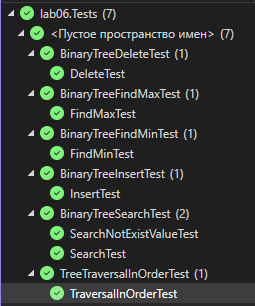
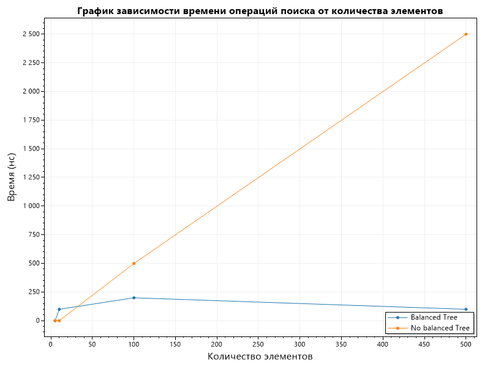
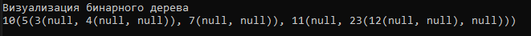
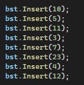
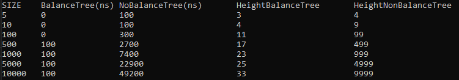

# Отчет по лабораторной работе 06

# Деревья. Бинарные деревья поиска

**Дата:** 2025-10-20

**Семестр:** 3 курс 1 полугодие - 5 семестр

**Группа:** ПИЖ-б-о-23-2

**Дисциплина:** Анализ сложности алгоритмов

**Студент:** Деревяшкин Валерий Васильевич

## Цель работы

- Изучить древовидные структуры данных, их свойства и применение.
- Освоить основные операции с бинарными деревьями поиска (BST).
- Получить практические навыки реализации BST на основе узлов (pointer-based), рекурсивных алгоритмов обхода и анализа их эффективности.
- Исследовать влияние сбалансированности дерева на производительность операций.

## Теоретическая часть

- **Дерево:** Рекурсивная структура данных, состоящая из узлов, где каждый узел имеет значение и ссылки на дочерние узлы.
- **Бинарное дерево поиска (BST):** Дерево, для которого выполняются следующие условия:
  Значение в левом поддереве любого узла меньше значения в самом узле.
  Значение в правом поддереве любого узла больше значения в самом узле.
  Оба поддерева являются бинарными деревьями поиска.
- **Основные операции BST:**
- **Вставка (Insert):** Сложность: в среднем O(log n), в худшем (вырожденное дерево) O(n).
- **Поиск (Search):** Сложность: в среднем O(log n), в худшем O(n).
- **Удаление (Delete):** Сложность: в среднем O(log n), в худшем O(n).
  Имеет три случая: удаление листа, узла с одним потомком, узла с двумя потомками.
- **Обход (Traversal):**
- **In-order (левый-корень-правый):** Посещает узлы в порядке возрастания. Сложность O(n).
- **Pre-order (корень-левый-правый):** Полезен для копирования структуры дерева. Сложность O(n).
- **Post-order (левый-правый-корень):** Полезен для удаления дерева. Сложность O(n).
- **Сбалансированные деревья:** Деревья с контролем высоты (например, AVL, Красно-черные), которые гарантируют время операций O(log n) даже в худшем случае.

## Практическая часть

### Выполненные задачи

- [x] Задача 1: Реализовать бинарное дерево поиска на основе узлов с основными операциями.
- [x] Задача 2: Реализовать различные методы обхода дерева (рекурсивные и итеративные).
- [x] Задача 3: Реализовать дополнительные методы для работы с BST.
- [x] Задача 4: Провести анализ сложности операций для сбалансированного и вырожденного деревьев.
- [x] Задача 5: Визуализировать структуру дерева.

### Ключевые фрагменты кода

Реализация класса TreeNode

```csharp
/// <summary>
/// Класс узла бинарного дерева.
/// </summary>
public class TreeNode
{
    /// <summary>
    /// Значение узла.
    /// </summary>
    public int Value;

    /// <summary>
    /// Левое поддерево узла.
    /// </summary>
    public TreeNode? Left;

    /// <summary>
    /// Правое поддерево узла.
    /// </summary>
    public TreeNode? Right;

    /// <summary>
    /// Конструктор.
    /// </summary>
    /// <param name="value">Значение.</param>
    public TreeNode(int value)
    {
        Value = value;
    }
}
```

Реализация BinarySearchTree

```csharp
/// <summary>
/// Класс бинарного дерева
/// </summary>
public class BinarySearchTree
{
    /// <summary>
    /// Корень дерева.
    /// </summary>
    public TreeNode? Root;

    /// <summary>
    /// Метод добавляет значение в дерево.
    /// </summary>
    /// <param name="value">Значение.</param>
    public void Insert(int value)
    {
        Root = Insert(Root!, value);

        // Средняя сложность: O(log n)
        // Худшая сложность: O(n) если дерево вырождено, длинная последовательная цепочка.
    }

    private TreeNode Insert(TreeNode node, int value)
    {
        if (node == null)
        {
            return new TreeNode(value);
        }

        if (value < node.Value)
        {
            node.Left = Insert(node.Left!, value);
        }

        else if (value > node.Value)
        {
            node.Right = Insert(node.Right!, value);
        }

        return node;
    }

    /// <summary>
    /// Метод проверяет наличие значения в дереве.
    /// </summary>
    /// <param name="node">Дерево.</param>
    /// <param name="value">Значение.</param>
    /// <returns>Признак проверки.</returns>
    public bool Search(TreeNode node, int value)
    {
        if (node is null || node.Value == value)
        {
            return node is not null;
        }

        if (value < node.Value)
        {
            return Search(node.Left!, value);
        }

        return Search(node.Right!, value);

        // Средняя сложность: O(log n)
        // Худшая: O(n)
    }

    /// <summary>
    /// Метод ищет значение минимума в дереве.
    /// </summary>
    /// <param name="node">Дерево.</param>
    /// <returns>Узел.</returns>
    public TreeNode? FindMin(TreeNode node)
    {
        if (node is null)
        {
            return null;
        }

        while (node.Left is not null)
        {
            node = node.Left;
        }

        return node;

        // Средняя: O(log n)
        // Худшая: O(n)
    }

    /// <summary>
    /// Метод ищет значение максимума в дереве.
    /// </summary>
    /// <param name="node">Дерево.</param>
    /// <returns>Узел.</returns>
    public TreeNode? FindMax(TreeNode node)
    {
        if (node is null)
        {
            return null;
        }

        while (node.Right is not null)
        {
            node = node.Right;
        }

        return node;

        // Средняя: O(log n)
        // Худшая: O(n)
    }

    /// <summary>
    /// Метод удаляет значение из дерева.
    /// </summary>
    /// <param name="value">Значение.</param>
    public void Delete(int value)
    {
        Root = Delete(Root!, value);

        // Средняя: O(log n)
        // Худшая: O(n)
    }

    private TreeNode? Delete(TreeNode node, int value)
    {
        if (node is null)
        {
            return null;
        }

        if (value < node.Value)
        {
            node.Left = Delete(node.Left!, value);
        }

        else if (value > node.Value)
        {
            node.Right = Delete(node.Right!, value);
        }

        else
        {
            // Если узел - лист(одно значение).
            if (node.Left is null && node.Right is null)
            {
                return null;
            }

            // Если у узла есть поддерево слева.
            if (node.Left is null)
            {
                return node.Right;
            }

            // Если у узла есть поддерево справа.
            if (node.Right is null)
            {
                return node.Left;
            }

            // Если у узла есть левое и правое поддерево.
            // Минимальное значение в правом поддереве.
            TreeNode minRight = FindMin(node.Right)!;

            // Замена значения узла на мин.значение из правого поддерева.
            node.Value = minRight.Value;

            // Удаление мин.значения из правого поддерева (значение уже в текущем узле).
            node.Right = Delete(node.Right, minRight.Value);
        }

        return node;
    }

    /// <summary>
    /// Метод вычисляет высоту дерева.
    /// </summary>
    /// <param name="node">Дерево.</param>
    /// <returns>Высота поддерева.</returns>
    public int Height(TreeNode node)
    {
        if (node is null)
        {
            return -1;
        }

        int left = Height(node.Left!);
        int right = Height(node.Right!);

        int result = Math.Max(left, right) + 1;

        return result;

        // Средняя: O(n)
        // Худшая: O(n)
    }

    /// <summary>
    /// Метод проверяет, является ли дерево корректным бинарным деревом поиска (BST).
    /// </summary>
    /// <returns>Признак проверки.</returns>
    public bool IsValidBst()
    {
        bool result = IsValidBst(Root!, int.MinValue, int.MaxValue);

        return result;

        // Средняя: O(n)
    }

    private bool IsValidBst(TreeNode node, int min, int max)
    {
        if (node is null)
        {
            return true;
        }

        if (node.Value <= min || node.Value >= max)
        {
            return false;
        }

        bool left = IsValidBst(node.Left!, min, node.Value);
        bool right = IsValidBst(node.Right!, node.Value, max);

        bool result = left && right;

        return result;
    }

```

Реализация класса Traversal

```csharp
/// <summary>
/// Класс для обхода бинарного дерева.
/// </summary>
public class TreeTraversal
{
    /// <summary>
    /// Метод In-Order обхода дерева (left, node, right).
    /// </summary>
    /// <param name="node">Дерево.</param>
    public static void InOrderRecursive(TreeNode node)
    {
        if (node is null)
        {
            return;
        }

        InOrderRecursive(node.Left!);

        Console.Write(node.Value + " ");

        InOrderRecursive(node.Right!);

        // Сложность: O(n) - посещает каждый узел ровно один раз.
    }

    /// <summary>
    /// Метод Pre-Order обхода дерева (node, left, right).
    /// </summary>
    /// <param name="node">Дерево.</param>
    public static void PreOrderRecursive(TreeNode node)
    {
        if (node is null)
        {
            return;
        }

        Console.Write(node.Value + " ");

        PreOrderRecursive(node.Left!);

        PreOrderRecursive(node.Right!);

        // Сложность: O(n) - посещает каждый узел ровно один раз.
    }

    /// <summary>
    /// Метод Post-Order обхода дерева (left, right, node).
    /// </summary>
    /// <param name="node">Дерево.</param>
    public static void PostOrderRecursive(TreeNode node)
    {
        if (node is null)
        {
            return;
        }

        PostOrderRecursive(node.Left!);

        PostOrderRecursive(node.Right!);

        Console.Write(node.Value + " ");

        // Сложность: O(n) - посещает каждый узел ровно один раз.
    }

    /// <summary>
    /// Метод итеративного In-Order обхода дерева (left, node, right).
    /// </summary>
    /// <param name="root">Дерево.</param>
    public static void InOrderIterative(TreeNode root)
    {
        Stack<TreeNode> stack = new Stack<TreeNode>();

        TreeNode current = root;

        while (current is not null || stack.Count > 0)
        {
            // Достигаем самого левого узла, сохраняя пройденные узлы в стек.
            while (current is not null)
            {
                stack.Push(current);
                current = current.Left!;
            }

            // Извлекаем узел из стека и обрабатываем его.
            current = stack.Pop();

            Console.Write(current.Value + " ");

            // Переходим к правому поддереву.
            current = current.Right!;
        }

        // Сложность: O(n) - посещает каждый узел ровно один раз.
    }
}
```

Unit test для операций: Delete, FindMax, FindMin, Inser, Search, Traversal In-Order

```csharp
/// <summary>
/// Класс теста удаления узла дерева.
/// </summary>
public class BinaryTreeDeleteTest
{
    [Fact]
    public void DeleteTest()
    {
        BinarySearchTree bst = new BinarySearchTree();

        bst.Insert(10);
        bst.Insert(5);

        bst.Delete(5);
    }
}

/// <summary>
/// Класс теста поиска максимального значения дерева.
/// </summary>
public class BinaryTreeFindMaxTest
{
    [Fact]
    public void FindMaxTest()
    {
        BinarySearchTree bst = new BinarySearchTree();

        bst.Insert(10);
        bst.Insert(5);
        bst.Insert(15);
        bst.Insert(20);

        TreeNode? result = bst.FindMax(bst.Root!);

        Assert.NotNull(result);
        Assert.True(result.Value > 0);
        Assert.Equal(20, result.Value);
    }
}

/// <summary>
/// Класс теста поиска минимального значения дерева.
/// </summary>
public class BinaryTreeFindMinTest
{
    [Fact]
    public void FindMinTest()
    {
        BinarySearchTree bst = new BinarySearchTree();

        bst.Insert(10);
        bst.Insert(5);
        bst.Insert(3);
        bst.Insert(15);
        bst.Insert(20);

        TreeNode? result = bst.FindMin(bst.Root!);

        Assert.NotNull(result);
        Assert.True(result.Value > 0);
        Assert.Equal(3, result.Value);
    }
}

/// <summary>
/// Класс теста добавления узла дерева.
/// </summary>
public class BinaryTreeInsertTest
{
    [Fact]
    public void InsertTest()
    {
        BinarySearchTree bst = new BinarySearchTree();

        bst.Insert(10);
        bst.Insert(5);
        bst.Insert(11);
        bst.Insert(3);
    }
}


/// <summary>
/// Класс теста поиска значений дерева.
/// </summary>
public class BinaryTreeSearchTest
{
    /// <summary>
    /// Метод ищет существующее значение.
    /// </summary>
    [Fact]
    public void SearchTest()
    {
        BinarySearchTree bst = new BinarySearchTree();

        bst.Insert(10);
        bst.Insert(5);
        bst.Insert(15);
        bst.Insert(20);

        bool result = bst.Search(bst.Root!, 20);

        Assert.True(result);
    }

    /// <summary>
    /// Метод ищет несуществующее значение.
    /// Результат выполнения ожидается = false.
    /// </summary>
    [Fact]
    public void SearchNotExistValueTest()
    {
        BinarySearchTree bst = new BinarySearchTree();

        bst.Insert(10);
        bst.Insert(5);
        bst.Insert(15);
        bst.Insert(20);

        bool result = bst.Search(bst.Root!, 30);

        Assert.False(result);
    }
}


/// <summary>
/// Класс теста In-Order обхода дерева.
/// </summary>
public class TreeTraversalInOrderTest
{
    [Fact]
    public void TraversalInOrderTest()
    {
        BinarySearchTree bst = new BinarySearchTree();

        bst.Insert(10);
        bst.Insert(5);
        bst.Insert(11);
        bst.Insert(3);
        bst.Insert(7);
        bst.Insert(23);
        bst.Insert(4);
        bst.Insert(12);

        TreeTraversal.InOrderRecursive(bst.Root!);
    }
}
```

##### Результат выполнения 7 unit тестов



---

## Результаты выполнения

### Пример работы программы

#### Зависимость времени выполнения 1000 операций поиска в деревьях разного размера и разной степени сбалансированности


**Сбалансированное дерево** - небольшой рост времени от 0 до 250нс, почти горизонтальное. На 500 узлов - низкое время, без ухудшений.
**Вырожденное дерево** - линейный рост времени от 0 до 250нс.


**Сбалансированное дерево** - время остается почти горизонтальным, с минимальным ростом времени при увеличении узлов дерева. Стабильная производительность, независимая от размера (логарифмический рост).
**Вырожденное дерево** - линейный рост времени, рост зависит от n (количество узлов в дереве), дерево вырождается в список, поиск становится последовательным.
**График сбалансированного дерева - подчеркивает преимущество для больших данных.**

Текстовая визуализация дерева



Зависимость времени от количества узлов, для BalanceTree - сбалансированное и NoBalanceTree вырожденное.


##### Характеристики ПК

- Процессор: Intel Core i7-12750H @ 2.30GHz
- Оперативная память: 24 GB DDR4
- ОС: Windows 11
- C# 14

## Ответы на контрольные вопросы

**1. Сформулируйте основное свойство бинарного дерева поиска (BST).**

- Основное свойство BST: Для любого узла дерева все значения в левом поддереве меньше значению корня, а в правом поддереве значения больше корня. Это обеспечивает упорядоченность данных и позволяет эффективный поиск (бинарный, O(log n)): влево, если значение меньше, вправо — если больше.

**2. Опишите алгоритм вставки нового элемента в BST. Какова сложность этой операции в сбалансированном и вырожденном дереве?**

- Алгоритм вставки:
  Начать с корня.
  Если дерево пустое — новый элемент становится корнем.
  Иначе: сравнить значение с текущим узлом. Если меньше - перейти в левое поддерево, если больше — в правое.
  Повторять, пока не найдём пустое место (null) - вставить новый узел как лист.

####

- Сложность:
  В сбалансированном дереве O(log n) - логарифмический.
  В вырожденном O(n) - путь может быть по всей длине дерева (как в списке).

**3. Чем отличается обход дерева в глубину (DFS) от обхода в ширину (BFS)? Назовите виды DFS обходов и их особенности.**

- DFS (Depth-First Search): В глубину - от корня к узлам, используя рекурсию. Подходит для задач, где нужно обойти дерево.
  BFS (Breadth-First Search): В ширь - по уровням (сверху вниз), используя очередь. Подходит для кратчайших путей.
- Виды DFS-обходов:
  In-order (LNR — левое, корень, правое): Даёт сортированный вывод в BST.
  Особенность: упорядоченный порядок.
- Pre-order (NLR — корень, левое, правое): Корень первым — для копирования.
- Post-order (LRN — левое, правое, корень): Корень последним — для удаления/вычислений снизу вверх.

**4. Почему в вырожденном BST (например, когда элементы добавляются в отсортированном порядке) сложность операций поиска и вставки становится O(n)?**

- В вырожденном дереве при добавлении элементов в отсортированном порядке - сложность операций поиска/вставки увеличивается до линейной(O(n)), из-за увеличиения проверок узлов, например при добавлении 1, 2, 3, n, все узлы будут в правом поддереве, что ухудшает поиск.

**5. Что такое сбалансированное дерево (например, AVL-дерево) и как оно решает проблему вырождения BST?**

- Сбалансированное дерево - это BST, где высота левого и правого поддеревьев любого узла отличается не более чем на 1 (или по правилам баланса).
- AVL-дерево - пример: после каждой вставки/удаления проверяется баланс (разница высот <= 1), и применяются ротации (левые/правые) для восстановления.
- Решение проблемы вырождения: Ротации автоматически перестраивают дерево, предотвращая линейность.
- Сложность O(log n), гарантируя O(log n) для операций, даже при худших входных данных (в отличие от простого BST).

## Выводы

1. Теоретическая и практическая сложность полностью совпадают
   Для сбалансированного — поиск имеет сложность O(log n).
   Для вырожденного — поиск имеет сложность O(n) как в линейном списке.
2. Структура дерева — ключевой фактор производительности
   Высота дерева определяет скорость всех операций.
   Чем равномернее дерево — поиск O(log n).
   Вырождение дерева приводит к многократному замедлению — O(n), потому что нужно выполнять больше сравнений.

## Приложения

Исходный код классов
  - [Unit test](https://github.com/uu546/DerevyashkinVV/tree/main/lab06/lab06.Tests)
  - [Analysis - замер производительности](https://github.com/uu546/DerevyashkinVV/blob/main/lab06/lab06/Analysis.cs)
  - [BinarySearchTree - реализация бинарного дерева](https://github.com/uu546/DerevyashkinVV/blob/main/lab06/lab06/BinarySearchTree.cs)
  - [TreeTraversal - реализация DFS обходов дерева](https://github.com/uu546/DerevyashkinVV/blob/main/lab06/lab06/TreeTraversal.cs)
- [Результат выполнения](https://github.com/uu546/DerevyashkinVV/tree/main/lab06/report)
