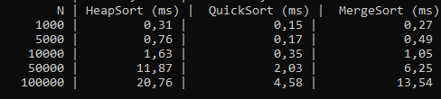
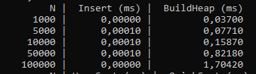
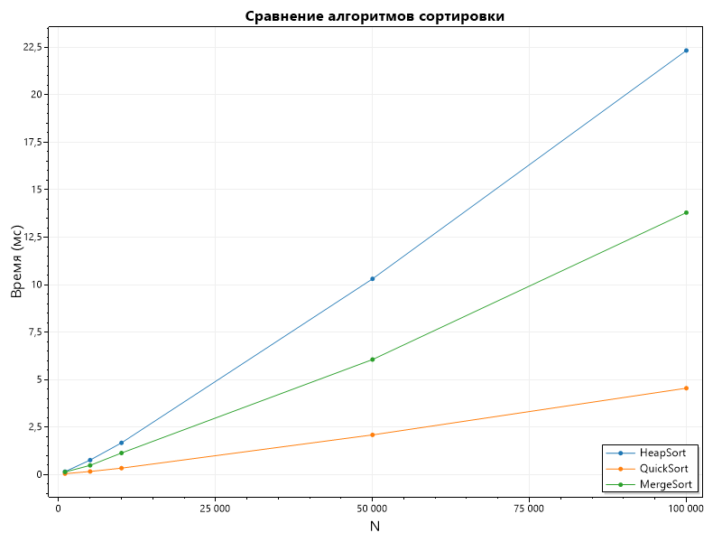
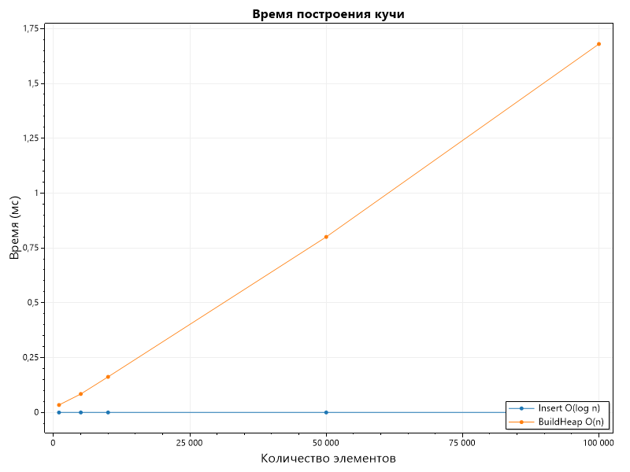

# Отчет по лабораторной работе 07

# Кучи (Heaps)

**Дата:** 2025-10-20

**Семестр:** 3 курс 1 полугодие - 5 семестр

**Группа:** ПИЖ-б-о-23-2

**Дисциплина:** Анализ сложности алгоритмов

**Студент:** Деревяшкин Валерий Васильевич

## Цель работы

- Изучить структуру данных "куча" (heap), её свойства и применение.
- Освоить основные операции с кучей (добавление, извлечение корня) и алгоритм её построения.
- Получить практические навыки реализации кучи на основе массива (array-based), а не указателей
- Исследовать эффективность основных операций и применение кучи для сортировки и реализации приоритетной очереди.

## Теоретическая часть

- **Куча (Heap):** Специализированная древовидная структура данных, удовлетворяющая свойству кучи. Является полным бинарным деревом (все уровни заполнены, кроме последнего, который
  заполняется слева направо).
- **Свойство кучи:**
- **Min-Heap:** Значение в любом узле меньше или равно значениям его потомков. Корень — минимальный элемент.
- **Max-Heap:** Значение в любом узле больше или равно значениям его потомков. Корень —
  максимальный элемент.
- **Реализация:** Куча эффективно реализуется на основе массива. Для узла с индексом i:
  - Индекс родителя: (i-1)//2
  - Индекс левого потомка: 2\*i + 1
  - Индекс правого потомка: 2\*i + 2
- **Основные операции:**
  - **Вставка (Insert):** Элемент добавляется в конец массива и "всплывает" (sift-up) до
    восстановления свойства кучи. Сложность: O(log n).
  - **Извлечение корня (Extract):** Корень (элемент [0]) извлекается, последний элемент
    ставится на его место и "погружается" (sift-down) до восстановления свойства кучи.
    Сложность: O(log n).
  - **Построение кучи (Heapify):** Преобразование произвольного массива в кучу. Может быть
    выполнено алгоритмом со сложностью O(n).
- **Применение:**
  - Сортировка кучей (Heapsort).
  - Реализация приоритетной очереди.
  - Алгоритм Дейкстры

## Практическая часть

### Выполненные задачи

- [x] Задача 1. Реализовать структуру данных "куча" (min-heap и max-heap) на основе массива.
- [x] Задача 2. Реализовать основные операции и алгоритм построения кучи из массива.
- [x] Задача 3. Реализовать алгоритм сортировки кучей (Heapsort).
- [x] Задача 4. Провести анализ сложности операций.
- [x] Задача 5. Сравнить производительность сортировки кучей с другими алгоритмами

### Ключевые фрагменты кода

Реализвация класса Heap(min heap), с методами

```csharp
/// <summary>
/// Класс бинарной кучи min-heap.
/// </summary>
public class Heap
{
    /// <summary>
    /// Массив элементов.
    /// </summary>
    private int[] _array;

    /// <summary>
    /// Количество элементов в куче.
    /// </summary>
    public int Count { get; set; }

    /// <summary>
    /// Конструктор.
    /// </summary>
    public Heap(int capacity = 16)
    {
        _array = new int[capacity];
        Count = 0;
    }

    /// <summary>
    /// Метод просеивания вверх - поднимает элемент до восстановления свойства кучи.
    /// </summary>
    /// <param name="index">Индекс элемента.</param>
    private void SiftUp(int index)
    {
        while (index > 0)
        {
            int parent = (index - 1) / 2;

            if (_array[parent] <= _array[index])
                break;

            int temp = _array[parent];
            _array[parent] = _array[index];
            _array[index] = temp;

            index = parent;
        }

        // Сложность: O(log n)
    }


    /// <summary>
    /// Метод просеивания вниз - восстанавливает свойство кучи после удаления корня.
    /// </summary>
    /// <param name="index">Индекс элемента.</param>
    private void SiftDown(int index)
    {
        while (true)
        {
            int left = index * 2 + 1;
            int right = index * 2 + 2;
            int smallest = index;

            if (left < Count && _array[left] < _array[smallest])
                smallest = left;

            if (right < Count && _array[right] < _array[smallest])
                smallest = right;

            if (smallest == index)
                break;

            int temp = _array[index];
            _array[index] = _array[smallest];
            _array[smallest] = temp;

            index = smallest;
        }

        // Сложность: O(log n)
    }

    /// <summary>
    /// Метод вставляет элемент в кучу.
    /// </summary>
    /// <param name="value">Значение.</param>
    public void Insert(int value)
    {
        _array[Count] = value;

        SiftUp(Count);
        Count++;

        // Сложность: O(log n)
    }

    /// <summary>
    /// Метод извлекает корень.
    /// </summary>
    public int Peek()
    {
        if (Count == 0)
            throw new InvalidOperationException("Heap is empty.");

        return _array[0];

        // Сложность: O(1).
    }

    /// <summary>
    /// Метод извлекает минимальный элемент из кучи.
    /// </summary>
    /// <returns>Максимальный элемент.</returns>
    public int Extract()
    {
        if (Count == 0)
            throw new InvalidOperationException("Heap is empty.");

        int root = _array[0];
        Count--;

        _array[0] = _array[Count];
        SiftDown(0);

        return root;

        // Сложность: O(log n).
    }

    /// <summary>
    /// Метод построения кучи из произвольного массива.
    /// </summary>
    /// <param name="array">Массив.</param>
    public void BuildHeap(int[] array)
    {
        _array = array;
        Count = array.Length;

        for (int i = Count / 2 - 1; i >= 0; i--)
            SiftDown(i);

        // Сложность: O(n).
    }

    /// <summary>
    /// Метод сортировки HeapSort.
    /// </summary>
    public static int[] HeapSort(int[] array)
    {
        Heap heap = new Heap(array.Length);

        heap.BuildHeap(array);

        int[] result = new int[array.Length];

        for (int i = 0; i < result.Length; i++)
        {
            result[i] = heap.Extract();
        }

        return result;

        // Сложность: O(n log n).
    }

    /// <summary>
    /// In-place HeapSort - сортирует массив без выделения памяти.
    /// </summary>
    /// <param name="array">Массив.</param>
    public static void HeapSortInPlace(int[] array)
    {
        int n = array.Length;

        for (int i = n / 2 - 1; i >= 0; i--)
        {
            SiftDownStatic(array, n, i);
        }

        for (int i = n - 1; i > 0; i--)
        {
            int temp = array[0];
            array[0] = array[i];
            array[i] = temp;

            SiftDownStatic(array, i, 0);
        }

        Array.Reverse(array);

        //Сложность: O(n log n).
    }

    /// <summary>
    /// Метод просеивания вниз для массива при сортировке.
    /// </summary>
    private static void SiftDownStatic(int[] array, int size, int index)
    {
        while (true)
        {
            int left = index * 2 + 1;
            int right = index * 2 + 2;
            int smallest = index;

            if (left < size && array[left] < array[smallest])
                smallest = left;

            if (right < size && array[right] < array[smallest])
                smallest = right;

            if (smallest == index)
                break;

            int temp = array[index];
            array[index] = array[smallest];
            array[smallest] = temp;

            index = smallest;
        }

    }
}

```

---

## Результаты выполнения

### Пример работы программы



Сравнение времени выполнения методов сортировок, в зависимости от количества элементов(в случайном порядке) в массиве.
На больших данных - эффективность показывает QuickSort(O(n log n)).

###



Сравнение времени выполнения методов Insert(O(log n)), BuildHeap(O(n)).

#### Зависимость времени выполнения алгоритмов сортировки от количества входных данных заполненных в случайном порядке



#### Зависимость времени выполнения операций Insert и BuildHeap



##### Характеристики ПК

- Процессор: Intel Core i7-12750H @ 2.30GHz
- Оперативная память: 24 GB DDR4
- ОС: Windows 11
- C# 14

## Ответы на контрольные вопросы

**1. Сформулируйте основное свойство min-кучи и max-кучи.**

- В min-кучи, каждый узел <= дочерних узлов, в корне минимальный элемент.
- В max-кучи, каждый узел >= дочерних узлов, в корне максимальный элемент.

**2. Опишите алгоритм операции вставки нового элемента в кучу (процедуру sift_up).**

- Алгоритм SiftUp (просеивание вверх):
  Поместить элемент x в конец массива кучи (в следующий свободный индекс кучи).
  Пока:
  x нарушает свойство кучи (для min-heap: x < parent)
  выполнять:
  обменять x с parent
  поднять x на уровень вверх
  Остановиться, когда свойство кучи восстановлено.

**3. Какова временная сложность построения кучи из произвольного массива и почему она равна O(n), а не O(n log n)?**

- Построение кучи через build_heap работает за O(n), потому что sift-down вызывается только для внутренних узлов, и чем выше узел, тем сложнее sift-down, но таких узлов очень мало. Большинство узлов находятся внизу и требуют O(1) работы.
  Суммарная стоимость всех sift-down даёт конечную сумму, равную O(n), а не O(n log n).

**4. Опишите, как работает алгоритм пирамидальной сортировки (Heapsort).**

- Heapsort использует max-heap для сортировки по возрастанию.
  Алгоритм:
  Построить max-heap из массива - O(n)
  Повторять n раз:
  Поменять местами корень и последний элемент
  Уменьшить размер кучи
  Выполнить sift-down для восстановления — O(log n)
  Итоговая сложность: O(n log n)

**5. Почему кучу часто используют для реализации приоритетной очереди? Какие операции приоритетной очереди она эффективно поддерживает?**

- Куча подходит для priority queue, потому что обеспечивает быстрый доступ к элементу с наивысшим/наименьшим приоритетом (он всегда в корне).
- Insert(enqueue) O(log n).
- Extract(dequeue) O(log n).
- Peek O(1) - корень кучи.

## Выводы

1. Куча - это бинарная структура данных, где каждый узел удовлетворяет свойству min- или max-упорядоченности, что позволяет быстро получать минимальный или максимальный элемент.
2. Вставка и удаление элементов работают эффективно благодаря процедурам sift_up и sift_down выполняющимся за O(log n).
3. Построение кучи из массива выполняется за O(n), потому что большинство элементов находится на нижнх уровнях и требует мало операций восстановления.
4. Heapsort использует max-кучу для последовательного извлечения максимальных элементов, обеспечивая сортировку за O(n log n) без дополнительной памяти.
5. Приоритетная очередь реализуется на куче, потому что она эффективно поддерживает ключевые операции: добавление элемента, получение минимума/максимума и удаление приоритетного элемента.

## Приложения

Исходный код классов

- [Heap - куча](https://github.com/uu546/DerevyashkinVV/blob/main/lab07/Heap.cs)
- [PriorityQueue - приоритетная очередь](https://github.com/uu546/DerevyashkinVV/blob/main/lab07/PriorityQueue.cs)
- [Результат выполнения](https://github.com/uu546/DerevyashkinVV/tree/main/lab07/report)
