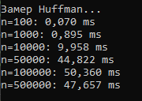
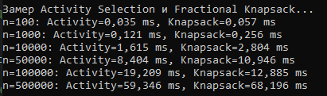
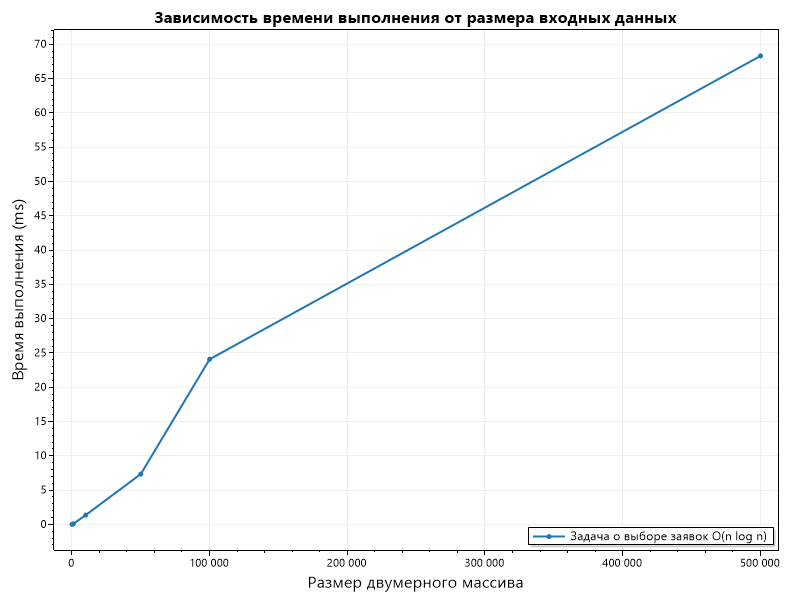
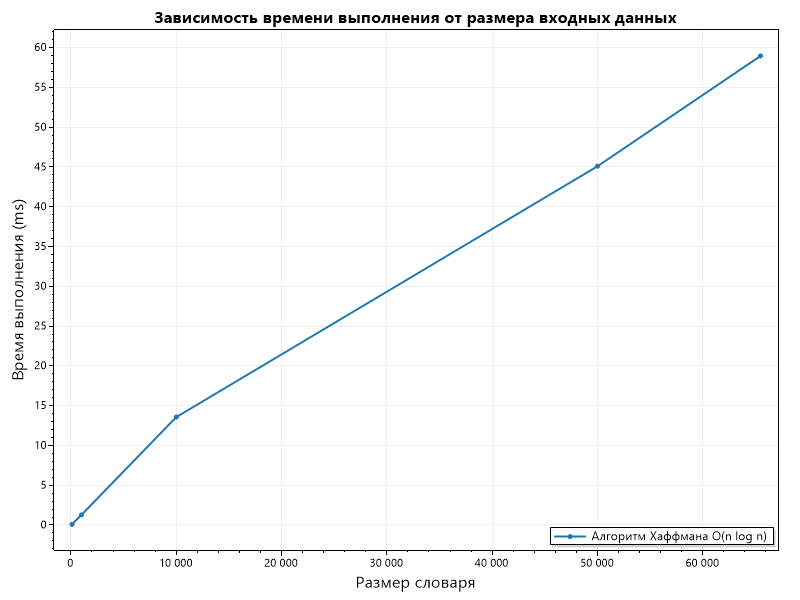
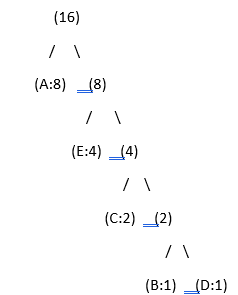
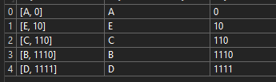

# Отчет по лабораторной работе 8

# Жадные алгоритмы

**Дата:** 2025-10-20

**Семестр:** 3 курс 1 полугодие - 5 семестр

**Группа:** ПИЖ-б-о-23-2

**Дисциплина:** Анализ сложности алгоритмов

**Студент:** Деревяшкин Валерий Васильевич

## Цель работы

- Изучить метод проектирования алгоритмов, известный как "жадный алгоритм".
- Освоить принцип принятия локально оптимальных решений на каждом шаге и понять условия, при которых этот подход приводит к глобально оптимальному решению.
- Получить практические навыки реализации жадных алгоритмов для решения классических задач анализа их корректности и оценки эффективности.

## Теоретическая часть

- **Жадный алгоритм:** Алгоритм, который на каждом шаге принимает локально оптимальное решение в надежде, что итоговое решение будет глобально оптимальным.
- **Ключевые характеристики:**
  - **Жадный выбор:** На каждом шаге выбирается лучший из доступных вариантов в данный момент, без учета последствий для будущих шагов.
  - **Оптимальная подструктура:** Оптимальное решение задачи содержит в себе оптимальные
    решения её подзадач.
- **Области применения:** Жадные алгоритмы эффективны для задач, где выбор, сделанный на каждом шаге, не ухудшает возможности достижения глобального оптимума. Они часто работают быстро (полиномиальное время), но не всегда приводят к оптимальному решению.
- **Классические задачи:**
  - **Задача о выборе заявок (Interval Scheduling):** Выбор максимального количества непересекающихся интервалов.
    **Задача о рюкзаке (Непрерывная/Дробная):** Выбор предметов с максимальной суммарной стоимостью, если можно брать части предметов.
  - **Алгоритм Хаффмана:** Оптимальное префиксное кодирование для сжатия данных.
  - **Построение минимального остовного дерева (Алгоритмы Прима и Краскала):** (Хотя
    это и графовый алгоритм, он является классическим примером жадного подхода).

## Практическая часть

### Выполненные задачи

- [x] Задача 1. Реализовать классические жадные алгоритмы.
- [x] Задача 2. Проанализировать их корректность (доказать или объяснить, почему жадный выбор приводит к оптимальному решению).
- [x] Задача 3. Провести сравнительный анализ эффективности жадного подхода и других методов(например, полного перебора для маленьких входных данных).
- [x] Задача 4. Решить практические задачи с применением жадного подхода.

### Ключевые фрагменты кода

```csharp
 /// <summary>
 /// Метод реализует задачу о выборе заявок.
 /// </summary>
 /// <param name="intervals">Массив с интервалами(начало, конец).</param>
 /// <returns>Список непересекающихся интервалов.</returns>
 public static int[][] ActivitySelection(int[][] intervals)
 {
     if (intervals is null || !intervals.Any())
     {
         return [];
     }

     // Сортировка по значениям окончания интервала.
     int[][] sorted = intervals.OrderBy(x => x[1]) // O(n log n)
         .ToArray();

     List<int[]> result = new List<int[]>();

     result.Add(sorted[0]);

     // Значение конца интервала.
     int last = sorted[0][1];

     for (int i = 1; i < sorted.Length; i++) // O(n)
     {
         // Начало следующего интервала >= конца прошлого.
         if (sorted[i][0] >= last)
         {
             result.Add(sorted[i]);
             last = sorted[i][1];
         }
     }

     return result.ToArray();

     // Сложность: O(n log n) - из-за сортировки.
 }


    /// <summary>
    /// Метод реализует непрерывный рюкзак.
    /// </summary>
    /// <param name="weights">Массив весов предметов.</param>
    /// <param name="values">Массив стоимости предметов.</param>
    /// <param name="capacity">Вместимость рюкзака.</param>
    /// <returns>Максимальная возможная стоимость предметов.</returns>
    public static double FractionalKnapsack(int[] weights, int[] values, int capacity)
    {
        if (weights is null || values is null || weights.Length != values.Length)
        {
            throw new InvalidOperationException("Ошибка");
        }

        var items = new (double ratio, int weight, int value)[weights.Length];

        for (int i = 0; i < weights.Length; i++)
        {
            // Заполняем массив кортежей.
            items[i] = ((double)values[i] / weights[i], weights[i], values[i]);
        }

        // O(n log n) - сортировка удельной стоимости по убыванию.
        Array.Sort(items, (a, b) => b.ratio.CompareTo(a.ratio));

        double totalValue = 0;
        int currentCapacity = capacity;

        foreach (var item in items) // O(n) - заполнение рюкзака предметами.
        {
            if (currentCapacity <= 0)
            {
                break;
            }

            // Если вес предмета полностью помещается в рюкзак.
            if (item.weight <= currentCapacity)
            {
                // Добавляем цену предмета.
                totalValue += item.value;

                currentCapacity -= item.weight;
            }

            else
            {
                // Берем дробную часть, для заполнения рюкзака.
                totalValue += item.ratio * currentCapacity;
                currentCapacity = 0;
            }
        }

        return totalValue;

        // Сложность: O(n log n) - из-за сортировки.
    }

    /// <summary>
    /// Метод реализует алгоритм Хаффмана.
    /// </summary>
    /// <param name="frequencies">Словарь частот символов.</param>
    /// <returns>Словарь (символ, код).</returns>
    public static Dictionary<char, string> HuffmanCoding(Dictionary<char, int> frequencies)
    {
        PriorityQueue<HuffmanNode, int> heap = new PriorityQueue<HuffmanNode, int>();

        foreach (var kvp in frequencies) // O(n) - добавление обьектов в очередь.
        {
            heap.Enqueue(new HuffmanNode // O(log n) - вставка в очередь.
            {
                Symbol = kvp.Key,
                Frequency = kvp.Value
            }, kvp.Value);
        }

        while (heap.Count > 1)
        {
            // Удаляем приоритетные элементы.
            var left = heap.Dequeue();
            var right = heap.Dequeue();

            var parent = new HuffmanNode
            {
                // Суммируем частоты.
                Frequency = left.Frequency + right.Frequency,
                Left = left,
                Right = right
            };

            // Добавляем элемент с левым и правым узлом в очередь.
            heap.Enqueue(parent, parent.Frequency);
        }

        HuffmanNode root = heap.Dequeue();
        Dictionary<char, string> codes = new Dictionary<char, string>();

        BuildCodes(root, "");

        return codes;

        void BuildCodes(HuffmanNode node, string code)
        {
            if (node is null)
            {
                return;
            }

            if (node.Symbol != '\0')
            {
                codes[node.Symbol] = code;
            }

            BuildCodes(node.Left!, code + "0");
            BuildCodes(node.Right!, code + "1");
        }

        // Сложность: O(n log n).
    }

    /// <summary>
    /// Метод решает задачу о минимальном количестве монет для выдачи сдачи.
    /// </summary>
    /// <param name="coins">Массив доступных монет.</param>
    /// <param name="amount">Сумма для выдачи.</param>
    /// <returns>Количество монет.</returns>
    public static int GetMinCountCoins(int[] coins, int amount)
    {
        if (amount < 0)
        {
            return -1;
        }

        if (amount == 0)
        {
            return 0;
        }

        Array.Sort(coins);
        Array.Reverse(coins);

        int count = 0;

        for (int i = 0; i < coins.Length; i++)
        {
            if (amount == 0)
            {
                break;
            }

            while (amount >= coins[i])
            {
                amount -= coins[i];
                count++;
            }
        }

        int result = amount == 0 ? count : -1;

        return result;
    }

    /// <summary>
    /// Класс узла алгоритма Хаффмана.
    /// </summary>
    private class HuffmanNode
    {
        /// <summary>
        /// Символ.
        /// </summary>
        public char Symbol { get; set; }

        /// <summary>
        /// Частота (повторение символа).
        /// </summary>
        public int Frequency { get; set; }

        /// <summary>
        /// Левый узел.
        /// </summary>
        public HuffmanNode? Left { get; set; }

        /// <summary>
        /// Правый узел.
        /// </summary>
        public HuffmanNode? Right { get; set; }
    }

    /// <summary>
/// Метод точного(0-1) рюкзака.
/// </summary>
/// <param name="weights">Вес.</param>
/// <param name="values">Цена.</param>
/// <param name="capacity">Вместимость рюкзака.</param>
/// <returns>Максимальная возможная стоимость предметов.</returns>
public static int ZeroOneKnapsackDP(int[] weights, int[] values, int capacity)
{
    int n = weights.Length;
    int[,] dp = new int[n + 1, capacity + 1];

    for (int i = 1; i <= n; i++)
    {
        for (int j = 0; j <= capacity; j++)
        {
            dp[i, j] = dp[i - 1, j];

            if (j >= weights[i - 1])
            {
                dp[i, j] = Math.Max(dp[i, j], dp[i - 1, j - weights[i - 1]] + values[i - 1]);
            }
        }
    }

    int result = dp[n, capacity];

    return result;

    // Сложность: O(n * W) n-число предметов, W-вместимость рюкзака.
}

 /// <summary>
 /// Метод 0-1(точного) рюкзака с жадным подходом, без деления предметов.
 /// </summary>
 /// <param name="weights">Вес предмета.</param>
 /// <param name="values">Цена предмета.</param>
 /// <param name="capacity">Вместимость рюкзака.</param>
 /// <returns>Стоимость добавленных предметов.</returns>
 public static int GreedyZeroOneKnapsack(int[] weights, int[] values, int capacity)
 {
     var items = new List<(double ratio, int weight, int value)>();
     for (int i = 0; i < weights.Length; i++)
     {
         items.Add(((double)values[i] / weights[i], weights[i], values[i]));
     }

     items.Sort((a, b) => b.ratio.CompareTo(a.ratio));

     int total = 0;
     int currentCapacity = capacity;

     foreach (var item in items)
     {
         // Добавляються только подходящие предметы по весу.
         if (item.weight <= currentCapacity)
         {
             total += item.value;
             currentCapacity -= item.weight;
         }

         // Дробления предметов нет.
     }

     return total;

     // Сложность: O(n log n) из-за сортировки.
 }
```

---

## Результаты выполнения

### Пример работы программы

Алгоритм Huffman. Результат замера времени выполнения от размера входных значений.



Алгоритмы ActivitySelection и FractionalKnapsack. Результат замера времени выполнения от размера входных значений.



###

#### Зависимость времени выполнения алгоритмов от размера входных значений.

Задача о выборе заявок

- Рост равномерный, без резких скачков, что соответствует O(n log n)



Задача о непрерывного жадного рюкзака

- Рост плавный, без резких скачков, на наборе данных наблюдается постепенное увеличение времени выполнения метода. График подтверждает сложность O(n log n)


Алгоритм Хаффмана

- Рост плавный, размер алфавита(входного параметра) увеличивает время выполнения. График подтверждает сложность O(n log n)



- Визуализация дерева, для значений
  {'A',8 },
  {'B', 1 },
  {'C', 2 },
  {'D', 1 },
  {'E', 4 }



- Результат присвоенных кодов для символов(часто встречающийся символ находится более ближе, чем символы которые имеют меньшую частоту). 



- Пример когда вместимость рюкзака меньше веса доступных предметов. 
- Жадный подход для дробного рюкзака дает оптимальный результат, а для дискретного(точного 0-1) демонстрирует неэффективность в задачах где можно делить вес предмета.
-  Дискретный рюкзак(0-1) - предметы не делимы, берутся целиком или ничего (weight <= capacity).
-   Имитация дискретного рюкзака с жадным подходом, даст неоптимальный результат, так как выберет предметы с наивысшей удельной стоимостью, что может в результате оставить много свободного места в рюкзаке не позволяющий взять другие предметы(например weight: 5, capacity: 3, рюкзак будет не полностью занятый). 


(вместимость рюкзака меньше веса доступных предметов.)

##### Характеристики ПК

- Процессор: Intel Core i7-12750H @ 2.30GHz
- Оперативная память: 24 GB DDR4
- ОС: Windows 11
- C# 14

## Ответы на контрольные вопросы

**1.  В чем заключается основная идея жадных алгоритмов?**
- Основная идея - на каждом шаге принимать локально оптимальное решение (самый "жадный" выбор - наиболее выгодный на данный момент), без учета других возможных вариантов(которые могут быть более оптимальны), в надежде достичь глобального оптимума. 

**2. Для задачи о выборе заявок (Interval Scheduling) жадный алгоритм, выбирающий интервалы с наименьшим временем окончания, является оптимальным. Объясните, почему эта жадная стратегия работает.**
- Жадная стратегия работает, потому что набор интервалов можно преобразовать, заменив первый интервал на жадный(самый рано заканчивающийся - сортировка по возрастанию), что позволит оставить максимум времени для остальных интервалов, сохраняя оптимальность.

**3. Приведите пример задачи, для которой жадный алгоритм дает оптимальное решение, и задачи, для которой он не дает.**

- Оптимальное решение: Fractional Knapsack(дробный рюкзак) - сортировка по убыванию для удельной стоимости предмета(value / weight) что дает максимально выгодный предмет.
- Не оптимально: 0-1 Knapsack(точный рюкзак) - жадная стратегия выбирает выгодный предмет по удельной стоимости что может в результате заполнить не весь рюкзак(берет выгодный предмет, оставляя свободные места в которые не поместятся следующие предметы), или упустить лучшую комбинацию.

**4. В чем разница между непрерывной (дробной) и дискретной (0-1) задачами о рюкзаке? Для какой из них жадный алгоритм оптимален?**

- В дробной можно брать части предметов(гибко заполнять рюкзак), в дискретной - только целиком или ничего(0-1) неделимые предметы. 
- Жадный оптимален для дробной(сортировка по value/weight что в последствии максимизирует общюю цену рюкзака), но не для дискретного рюкзак, потому что может не быть подходящего предмета по весу.

- Жадный алгоритм  оптимален для дробного рюкзака.


**5. Опишите жадный алгоритм построения кода Хаффмана. В чем его оптимальность?**
- Алгоритм Хаффмана жадный, потому что на каждом шаге выбирает два символа (или узла) с минимальной частотой и объединяет их. Этот выбор локально оптимален и не может привести к ухудшению результата.

- Оптимальность достигается благодаря тому, что для любого оптимального префиксного кода можно доказать, что два самых редких символа обязательно образуют пару на максимальной глубине дерева. Алгоритм Хаффмана использует это свойство, поэтому всегда строит код минимальной суммарной длины.

## Выводы

1. Жадные стратегии принимают решения локально оптимальным образом. На каждом шаге выбирается наиболее выгодный текущий вариант без анализа будущих последствий. Жадные стратегии подходят для дробных задач.
2. Жадные стратегии работают там, где локальный лучший выбор не разрушает глобальную оптимальность. В задаче о выборе заявок (Interval Scheduling) выбор интервала с наименьшим временем окончания оставляет максимум свободного времени для остальных заявок, и любую оптимальную последовательность можно преобразовать к жадной, сохранив её оптимальность.
3. Жадные стратегии оптимальны не для всех задач: важен тип(дробная, дискретная) задачи. Для дробного рюкзака жадный выбор предметов по убыванию value/weight всегда приводит к наилучшему решению. Для дискретного 0–1 рюкзака жадный выбор не гарантирует оптимума, поскольку предметы неделимы, и выгодный предмет по удельной стоимости может блокировать более подходящую комбинацию.

## Приложения

Исходный код классов

- [GreedyAlgorithm - жадные алгоритмы](https://github.com/uu546/DerevyashkinVV/blob/main/lab08/GreedyAlgorithm.cs)
- [Результат выполнения](https://github.com/uu546/DerevyashkinVV/tree/main/lab08/report)