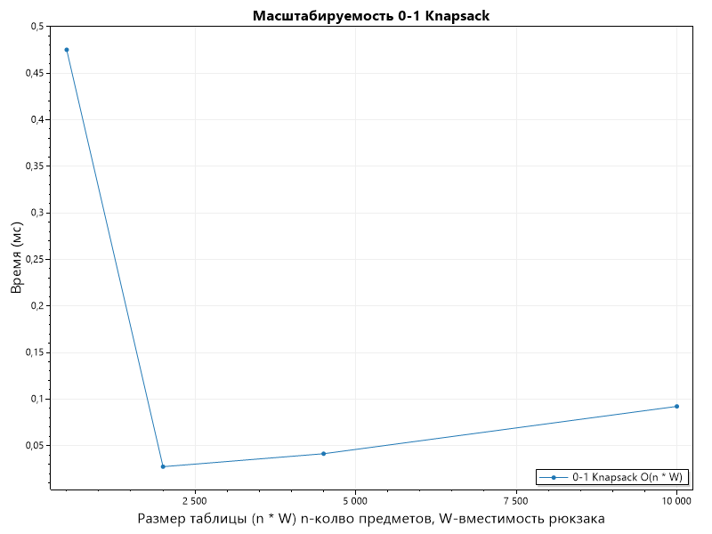

# Отчет по лабораторной работе 9

# Динамическое программирование

**Дата:** 2025-10-20

**Семестр:** 3 курс 1 полугодие - 5 семестр

**Группа:** ПИЖ-б-о-23-2

**Дисциплина:** Анализ сложности алгоритмов

**Студент:** Деревяшкин Валерий Васильевич

## Цель работы

- Изучить метод динамического программирования (ДП) как мощный инструмент для решения сложных задач путём их разбиения на перекрывающиеся подзадачи. 
- Освоить два основных подхода к реализации ДП: нисходящий (с мемоизацией) и восходящий (с заполнением таблицы).
- Получить практические навыки выявления оптимальной подструктуры задач, построения таблиц ДП анализа временной и пространственной сложности алгоритмов.

## Теоретическая часть

- **Динамическое программирование (ДП):** Метод решения задач, в которых оптимальное
решение всей задачи зависит от оптимальных решений её перекрывающихся подзадач.
- **Ключевые принципы:**
- **Оптимальная подструктура:** Оптимальное решение задачи может быть построено из оптимальных решений её подзадач.
- **Перекрывающиеся подзадачи:** Подзадачи, решения которых используются многократно, а не один раз.
- **Подходы к реализации:**
- **Нисходящее ДП (Top-Down, с мемоизацией):** Рекурсивное решение с сохранением (кэшированием) результатов решения подзадач для повторных вычислений.
- **Восходящее ДП (Bottom-Up, табличное):** Итеративное решение, при котором подзадачи решаются от простейших к сложным, а их результаты заносятся в таблицу (массив).
- **Области применения:** Задачи оптимизации, подсчёта количества способов, нахождения наиболее вероятной последовательности.
- **Классические задачи:**
- **Числа Фибоначчи:** Классический пример перекрывающихся подзадач.
- **Задача о рюкзаке (0-1 Knapsack):** Выбор предметов с максимальной суммарной стоимостью без дробления.
- **Наибольшая общая подпоследовательность (LCS):** Поиск самой длинной последовательности символов, которая является подпоследовательностью двух строк.
- **Расстояние Левенштейна (Редакционное расстояние):** Минимальное количество операций вставки, удаления и замены символа, необходимых для превращения одной строки в другую.

## Практическая часть

### Выполненные задачи

- [x] Задача 1. Реализовать классические алгоритмы динамического программирования.
- [x] Задача 2. Реализовать оба подхода (нисходящий и восходящий) для решения задач.
- [x] Задача 3. Провести сравнительный анализ эффективности двух подходов.
- [x] Задача 4. Проанализировать временную и пространственную сложность алгоритмов.
- [x] Задача 5. Решить практические задачи с применением ДП.

### Ключевые фрагменты кода
```csharp
/// <summary>
/// Наивная рекурсия для вычисления числа Фибоначчи.
/// </summary>
/// <param name="n">Индекс числа Фибоначчи.</param>
/// <returns>Число Фибоначчи.</returns>    
public static long FibonacciNaive(int n)
{
    if (n <= 1)
    {
        return n;
    }

    long fibMinus1 = FibonacciNaive(n - 1);
    long fibMinus2 = FibonacciNaive(n - 2);

    return fibMinus1 + fibMinus2;

    // Временная сложность: O(2^n) - экспоненциальная из-за перекрывающихся(повторы) подзадач.
    // Пространственная сложность: O(n) - глубина рекурсии.
}

/// <summary>
/// Рекурсия с мемоизацией (нисходящее ДП) для числа Фибоначчи.
/// </summary>
/// <param name="n">Индекс числа Фибоначчи.</param>
/// <returns>Число Фибоначчи.</returns>
public static long FibonacciMemo(int n)
{
    long[] memo = new long[n + 1];

    Array.Fill(memo, -1);

    return FibonacciMemoHelper(n, memo);

    // Временная сложность: O(n) - каждая подзадача решается один раз.
    // Пространственная сложность: O(n) - выделение массива для мемоизации и рекурсия.
}

private static long FibonacciMemoHelper(int n, long[] memo)
{
    if (n <= 1)
    {
        return n;
    }

    if (memo[n] != -1)
    {
        return memo[n];
    }

    long fibMinus1 = FibonacciMemoHelper(n - 1, memo);
    long fibMinus2 = FibonacciMemoHelper(n - 2, memo);

    // Один раз вычисляем число.
    memo[n] = fibMinus1 + fibMinus2;

    return memo[n];
}

/// <summary>
/// Итеративное табличное решение (восходящее ДП) для числа Фибоначчи.
/// </summary>
/// <param name="n">Индекс числа Фибоначчи.</param>
/// <returns>Число Фибоначчи.</returns>
public static long FibonacciIterative(int n)
{
    if (n <= 1)
    {
        return n;
    }

    long[] dp = new long[n + 1];

    dp[0] = 0;
    dp[1] = 1;

    for (int i = 2; i <= n; i++)
    {
        dp[i] = dp[i - 1] + dp[i - 2];
    }

    return dp[n];

    // Временная сложность: O(n) - линейный проход.
    // Пространственная сложность: O(n) - таблица.
}

/// <summary>
/// Динамическое программирование для задачи 0-1 рюкзака (восходящее).
/// </summary>
/// <param name="weights">Веса предметов.</param>
/// <param name="values">Ценности предметов.</param>
/// <param name="capacity">Вместимость рюкзака.</param>
/// <returns>Максимальная ценность и список выбранных индексов предметов.</returns>
public static (int maxValue, List<int> selectedItems) Knapsack01(int[] weights, int[] values, int capacity)
{
    int n = weights.Length;
    int[,] dp = new int[n + 1, capacity + 1];

    for (int i = 1; i <= n; i++)
    {
        for (int w = 0; w <= capacity; w++)
        {
            dp[i, w] = dp[i - 1, w];
            if (w >= weights[i - 1])
            {
                dp[i, w] = Math.Max(dp[i, w], dp[i - 1, w - weights[i - 1]] + values[i - 1]);
            }
        }
    }

    // Восстановление решения.
    List<int> selected = new List<int>();

    int res = dp[n, capacity];

    int remaining = capacity;

    for (int i = n; i > 0; i--)
    {
        if (dp[i, remaining] != dp[i - 1, remaining])
        {
            selected.Add(i - 1);  // Индекс предмета
            remaining -= weights[i - 1];
        }
    }

    selected.Reverse();

    (int, List<int>) result = (res, selected);

    return result;

    // Временная сложность: O(n * capacity) — заполнение таблицы.
    // Пространственная сложность: O(n * capacity) — 2D таблица.
}

/// <summary>
/// Наибольшая общая подпоследовательность (LCS) — восходящее ДП.
/// </summary>
/// <param name="s1">Первая строка.</param>
/// <param name="s2">Вторая строка.</param>
/// <returns>Длина LCS и сама подпоследовательность.</returns>
public static (int length, string subsequence) LongestCommonSubsequence(string s1, string s2)
{
    int m = s1.Length;
    int n = s2.Length;

    int[,] dp = new int[m + 1, n + 1];

    for (int i = 1; i <= m; i++)
    {
        for (int j = 1; j <= n; j++)
        {
            if (s1[i - 1] == s2[j - 1])
            {
                dp[i, j] = dp[i - 1, j - 1] + 1;
            }
            else
            {
                dp[i, j] = Math.Max(dp[i - 1, j], dp[i, j - 1]);
            }
        }
    }

    // Восстановление LCS.
    string lcs = "";
    int ii = m;
    int jj = n;

    while (ii > 0 && jj > 0)
    {
        if (s1[ii - 1] == s2[jj - 1])
        {
            lcs = s1[ii - 1] + lcs;
            ii--; jj--;
        }

        else if (dp[ii - 1, jj] > dp[ii, jj - 1])
        {
            ii--;
        }

        else
        {
            jj--;
        }
    }

    (int, string) result = (dp[m, n], lcs);

    return result;

    // Временная сложность: O(m * n) — заполнение таблицы.
    // Пространственная сложность: O(m * n) — таблица.
}
```

---

## Результаты выполнения

#### Зависимость времени выполнения рюкзака от размера входных значений.
Алгоритм рюкзака 0-1


- График имеет ярко выраженную U-образную форму: сначала время падает с ростом размера таблицы, достигает минимума около n*W = 2500, а затем начинает медленно расти.
- График отражает классический рост с табличным динамическим программированием

##### Характеристики ПК

- Процессор: Intel Core i7-12750H @ 2.30GHz
- Оперативная память: 24 GB DDR4
- ОС: Windows 11
- C# 14

## Ответы на контрольные вопросы
**1. Какие два основных свойства задачи указывают на то, что для ее решения можно применить динамическое программирование?**
- Два основных свойства задачи для применения динамического программирования
  - Оптимальная подструктура: Оптимальное решение исходной задачи можно построить из оптимальных решений её подзадач (например, максимум для всей задачи = max(без элемента + подзадача, с элементом + подзадача). 
  - Перекрывающиеся подзадачи: В рекурсивном разбиении одни и те же подзадачи возникают многократно, что позволяет кэшировать их решения для избежания повторных вычислений.

**2. В чем разница между нисходящим (top-down) и восходящим (bottom-up) подходами в динамическом программировании?**
- Нисходящий (top-down): Рекурсивный подход — начинается с большой задачи, разбивает на подзадачи и использует мемоизацию (кэш, например, Dictionary) для хранения результатов. Решает только нужные подзадачи, но может иметь overhead рекурсии и риск StackOverflow.
- Восходящий (bottom-up): Итеративный подход — заполняет таблицу (массив) от базовых случаев (маленьких подзадач) к большой задаче. Решает все подзадачи, но эффективнее по памяти и без рекурсии.

**3. Как задача о рюкзаке 0-1 демонстрирует свойство оптимальной подструктуры?**
- В задаче 0-1 рюкзака оптимальное решение для первых i предметов и вместимости w строится из оптимальных решений для i-1 предметов: dp[i][w] = max(dp[i-1][w], dp[i-1][w - weight[i]] + value [i]). Это показывает, что добавление i-го предмета (если влезает) даёт подзадачу с уменьшенной вместимостью, и максимум из "с предметом" и "без" — оптимален для всей задачи.

**4. Опишите, как строится и заполняется таблица для решения задачи о наибольшей общей подпоследовательности (LCS).**
- Таблица LCS строится как таблица динамического программирования размером (n+1) × (m+1), где n и m — длины строк.
- Каждая ячейка dp[i][j] заполняется по правилу: если символы совпадают — dp[i−1][j−1] + 1, иначе берётся максимум из dp[i−1][j] и dp[i][j−1].
- После заполнения таблицы значение в dp[n][m] даёт длину LCS.

**5. Как с помощью динамического программирования можно уменьшить сложность вычисления чисел Фибоначчи с экспоненциальной до линейной или даже до O(log n)?**
- Без ДП: Наивная рекурсия F(n) = F(n-1) + F(n-2) — O(2^n) из-за перекрывающихся подзадач (F(k) вычисляется многократно).
Линейная O(n): Мемоизация (top-down).

## Приложения

Исходный код классов

- [DynamicProgramming - динамическое программирование](https://github.com/uu546/DerevyashkinVV/blob/main/lab09/DynamicProgramming.cs)
- [Результат выполнения](https://github.com/uu546/DerevyashkinVV/tree/main/lab09/report)