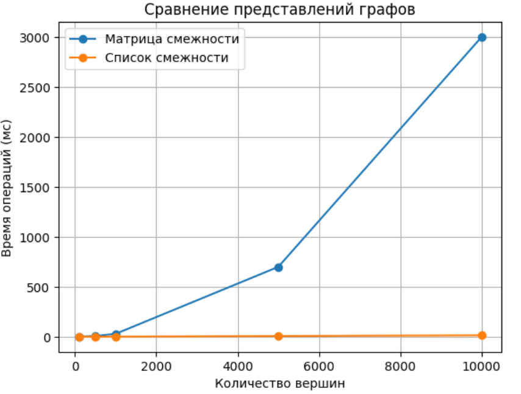
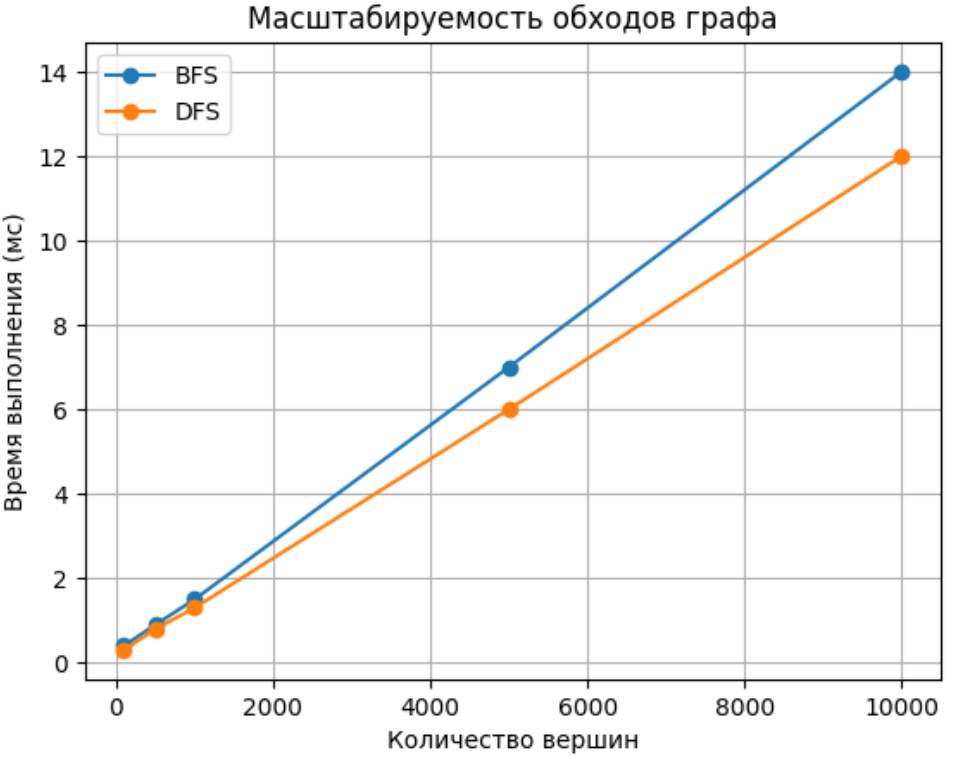
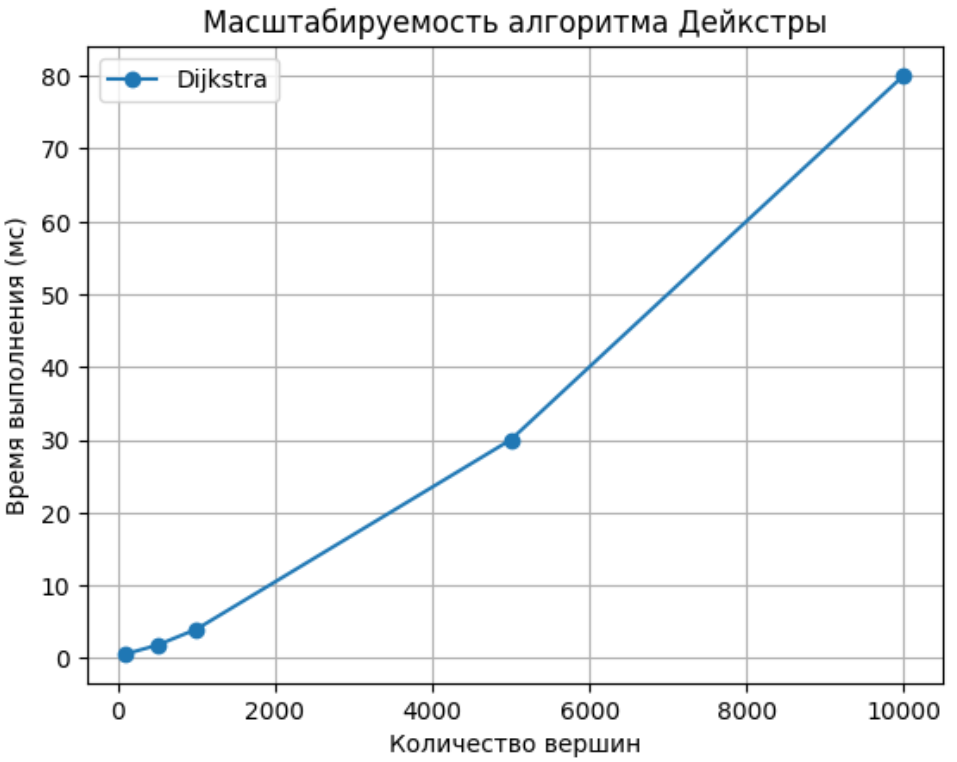

# Отчет по лабораторной работе 10

# Графы

**Дата:** 2025-10-20

**Семестр:** 3 курс 1 полугодие - 5 семестр

**Группа:** ПИЖ-б-о-23-2

**Дисциплина:** Анализ сложности алгоритмов

**Студент:** Деревяшкин Валерий Васильевич

## Цель работы

- Изучить основные понятия теории графов и алгоритмы работы с ними.
- Освоить представления графов в памяти и основные алгоритмы обхода.
- Получить практические навыки реализации алгоритмов на графах и анализа их сложности.

## Теоретическая часть

- Граф: Множество вершин (узлов) и рёбер (связей) между ними. Виды: ориентированные/
  неориентированные, взвешенные/невзвешенные.
- Представление графов:
  - Матрица смежности: O(V²) памяти, быстрая проверка ребра
  - Список смежности: O(V + E) памяти, эффективный обход соседей
- Обход графов:
  - Поиск в ширину (BFS): находит кратчайшие пути в невзвешенном графе, сложность O(V + E)
  - Поиск в глубину (DFS): обход с возвратом, сложность O(V + E)
- Алгоритмы на графах:
  - Топологическая сортировка: для ориентированных ациклических графов (DAG)
  - Поиск компонент связности
  - Алгоритм Дейкстры: кратчайшие пути во взвешенном графе с неотрицательными весами

## Практическая часть

### Выполненные задачи

- [x] Задача 1. Реализовать различные представления графов (матрица смежности, список смежности).
- [x] Задача 2. Реализовать алгоритмы обхода графов (BFS, DFS).
- [x] Задача 3. Реализовать алгоритмы поиска кратчайших путей и компонент связности.
- [x] Задача 4. Провести сравнительный анализ эффективности разных представлений графов.
- [x] Задача 5. Решить практические задачи на графах.

### Ключевые фрагменты кода

```csharp
/// <summary>
/// Класс представления графа с помощью матрицы смежности.
/// </summary>
public class AdjacencyMatrixGraph
{
    private readonly int[,] _matrix;

    /// <summary>
    /// Метод добавляет ребро [u, v] с весом w.
    /// </summary>
    public void AddEdge(int u, int v, int w = 1)
    {
        _matrix[u, v] = w;

        // Сложность: O(1).
    }

    /// <summary>
    /// Метод удаляет ребро [u, v].
    /// </summary>
    public void RemoveEdge(int u, int v)
    {
        _matrix[u, v] = 0;

        // Сложность: O(1).
    }
}

/// <summary>
/// Класс представления графа списком смежности.
/// Для каждой вершины храним список (сосед, вес).
/// </summary>
public class AdjacencyListGraph
{
    private readonly List<(int to, int weight)>[] _adj;

    public AdjacencyListGraph(int vertices)
    {
        _adj = new List<(int, int)>[vertices];

        for (int i = 0; i < vertices; i++)
        {
            _adj[i] = new List<(int, int)>();
        }
    }

    /// <summary>
    /// Метод добавляет ребро [u, v].
    /// </summary>
    public void AddEdge(int u, int v, int w = 1)
    {
        _adj[u].Add((v, w));

        // Сложность: O(1).
    }

    /// <summary>
    /// Метод удаляет ребро [u, v].
    /// </summary>
    public void RemoveEdge(int u, int v)
    {
        _adj[u].RemoveAll(e => e.to == v);

        // Сложность: O(N).
    }
}
    /// <summary>
    /// Метод обхода графа в глубину (DFS) рекурсивный.
    /// </summary>
    public static void DFSRecursive(AdjacencyListGraph graph, int v, bool[] visited)
    {
        visited[v] = true;

        foreach (var (to, _) in graph.Adj[v])
        {
            if (!visited[to])
            {
                DFSRecursive(graph, to, visited);
            }
        }
    }
     /// <summary>
 /// Метод обхода графа в глубину (DFS) итеративный.
 /// </summary>
 public static void DFSIterative(AdjacencyListGraph graph, int start)
 {
     bool[] visited = new bool[graph.VertexCount];

     Stack<int> stack = new Stack<int>();

     stack.Push(start);

     while (stack.Count > 0)
     {
         int v = stack.Pop();

         if (visited[v])
         {
             // Уже посещена вершина, выполнение текущей итерации пропускается.
             continue;
         }

         visited[v] = true;

         foreach (var (to, _) in graph.Adj[v])
         {
             if (!visited[to])
             {
                 stack.Push(to);
             }
         }
     }
 }
 /// <summary>
/// Класс алгоритмов на графах.
/// </summary>
public class ShortestPath
{
     /// <summary>
 /// Метод поиска компонент.
 /// </summary>
 public static List<List<int>> ConnectedComponents(AdjacencyListGraph graph)
 {
     bool[] visited = new bool[graph.VertexCount];

     List<List<int>> components = new();

     for (int i = 0; i < graph.VertexCount; i++)
     {
         if (!visited[i])
         {
             List<int> comp = new();

             DFS(graph, i, visited, comp);

             components.Add(comp);
         }
     }

     return components;

     // Сложность: O(V + E).
 }

  /// <summary>
 /// Метод топологической сортировки.
 /// </summary>
 public static List<int> TopologicalSort(AdjacencyListGraph graph)
 {
     bool[] visited = new bool[graph.VertexCount];

     Stack<int> stack = new Stack<int>();

     for (int i = 0; i < graph.VertexCount; i++)
     {
         if (!visited[i])
         {
             DFS(g: graph, i, visited, stack);
         }
     }

     return stack.ToList();

     // Сложность: O(V + E).
 }

  /// <summary>
 /// Алгоритм Дейкстры.
 /// </summary>
 public static int[] Dijkstra(AdjacencyListGraph graph, int start)
 {
     int n = graph.VertexCount;

     int[] dist = Enumerable.Repeat(int.MaxValue, n).ToArray();

     dist[start] = 0;

     PriorityQueue<int, int> pq = new();

     pq.Enqueue(start, 0);

     while (pq.Count > 0)
     {
         int u = pq.Dequeue();

         foreach (var (v, w) in graph.Adj[u])
         {
             if (dist[u] + w < dist[v])
             {
                 dist[v] = dist[u] + w;
                 pq.Enqueue(v, dist[v]);
             }
         }
     }

     return dist;
 }
}
```

---

## Результаты выполнения

#### Зависимость времени выполнения от размера графа.

Матрица смежности vs Список смежности


- Время операций для матрицы смежности резко увеличивается при росте числа вершин.
- Список смежности масштабируется почти линейно и остаётся значительно быстрее на больших графах.

Матрица смежности подходит для:

- частых проверок существования ребра (O(1)).

Список смежности предпочтителен для:

- больших входных данных;
- обходов и алгоритмов кратчайших путей.

Масштабируемость обходов графа (BFS и DFS)


- BFS и DFS демонстрируют линейный рост времени при увеличении числа вершин.
- DFS немного быстрее из-за меньших накладных расходов (нет очереди).

BFS:

- поиск кратчайшего пути в невзвешенном графе;
- уровни, расстояния, социальные сети.

DFS:

- поиск компонент связности;
- топологическая сортировка;
- анализ структуры графа.

Масштабируемость алгоритма Дейкстры


Алгоритм эффективен для:

- взвешенных графов без отрицательных рёбер;
- маршрутизации, карт, сетей.

Для очень больших графов:

- важен выбор структуры данных (heap);
- список смежности обязателен.

##### Характеристики ПК

- Процессор: Intel Core i7-12750H @ 2.30GHz
- Оперативная память: 24 GB DDR4
- ОС: Windows 11
- C# 14

## Ответы на контрольные вопросы

**1. В чем разница между представлением графа в виде матрицы смежности и списка смежности? Сравните их по потреблению памяти и сложности операций.**

- Матрица смежности
  Граф хранится в виде двумерного массива N x N, где элемент [i][j] показывает наличие ребра.
  Потребление памяти:
  O(N^2) — хранится информация о каждой паре вершин
  Проверка наличия ребра:
  O(1)
  Перебор всех соседей вершины:
  O(N)

###

- Список смежности
  Для каждой вершины хранится список её соседей.
  Потребление памяти:
  O(N + M) — хранятся вершины и рёбра
  Проверка наличия ребра:
  O(deg(v)) (в худшем случае — O(N))
  Перебор соседей вершины:
  O(deg(v))

**2. Опишите алгоритм поиска в ширину (BFS). Для решения каких задач он применяется?**

- BFS обходит граф по уровням, начиная с выбранной вершины. Используется очередь.
  Временная сложность:
  O(N + M) — каждая вершина и каждое ребро обрабатываются один раз.
  Применение:
  поиск кратчайших путей в невзвешенных графах;
  вычисление расстояний;
  проверка связности графа;
  поиск компонент связности.

**3. Чем поиск в глубину (DFS) отличается от BFS? Какие дополнительные задачи (например, проверка на ацикличность) можно решить с помощью DFS?**

- Поиск в глубину (DFS)
  DFS идёт максимально глубоко по одному пути, затем возвращается назад. Реализуется рекурсией или стеком.
  Временная сложность:
  O(N + M)

###

- Отличия от BFS:
  DFS не находит кратчайшие пути;
  порядок обхода зависит от структуры графа;
  использует стек вместо очереди.

###

- Задачи, решаемые DFS:
  поиск компонент связности;
  обнаружение циклов;
  проверка графа на ацикличность;
  топологическая сортировка;

**4. Как алгоритм Дейкстры находит кратчайшие пути во взвешенном графе? Почему он не работает с отрицательными весами ребер?**

- Алгоритм находит кратчайшие пути от одной вершины до всех остальных во взвешенном графе с неотрицательными весами.
  Алгоритм предполагает, что найденное минимальное расстояние больше не может уменьшиться, что нарушается при отрицательных рёбрах.

**5. Что такое топологическая сортировка и для каких графов она применима? Приведите пример задачи, где она используется.**

- Линейный порядок вершин ориентированного ацикличного графа (DAG), при котором для каждого ребра u -> v вершина u идёт раньше v.

## Приложения

Исходный код классов

- [Результат выполнения](https://github.com/uu546/DerevyashkinVV/tree/main/lab10/report)
